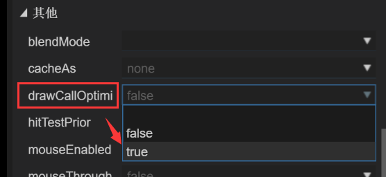

# LayaAir 2.0 正式版发布了，重要特性全面介绍

> author ：charley   Date：2019-1-19

自9月15日首次发布LayaAir 2.0 引擎测试版以来（[点此查看2.0引擎新特性](http://mp.weixin.qq.com/s?__biz=MzAxMjI4NjA1OA==&mid=2650584322&idx=1&sn=375e3dceaaf2b405e728bcba8f174d1e&chksm=83bc3407b4cbbd11c76ea98a032c328e253b80163cd4e68f3ebe5ced75b36beeccf511e87132&scene=21#wechat_redirect)），历时`4`个多月，推出`4`个2.0 beta版本，其中修复BUG若干，2D引擎与IDE优化与新增功能`39`项，3D引擎与插件优化与新增功能`22`项。在引擎组团队的不懈努力下，终于为开发者带来了2.0的稳定正式版。在此，也感谢大量参与测试和反馈BUG的开发者。

首先，先为大家介绍一下本次正式版最核心的几个更新：

### 1、增加2D引擎的drawCall优化的功能（drawCallOptimize）

2D引擎中，DrawCall数量多必然会引起性能下降。LayaAir引擎在图片的渲染方面做了很多优化，比如相邻的相同图集在渲染的时候，会自动合并起来一起渲染，这样就可以减少DrawCall的数量。然而，如果UI使用时将不同图集或文本穿插必然会打断图集的合并渲染。造成因开发者使用不当而产生的不必要性能开销，导致可能出现性能上的卡顿。

在以往的LayaAirIDE优化方案里，只要开发者将相同颜色的图集资源放在相邻的位置进行排列，引擎就会进行自动合并渲染，进行性能上的优化。优化方式如图1所示。

 

（图1）

虽然图集资源按颜色排序的方式优化效果比较明显，但是在少数复杂场景的时候，还是有少量不可避免的文本穿插现象出现，为了追求更极致的性能优化。LayaAir 2.0正式版中，IDE内新增了drawCallOptimize优化参数，默认值为false，如图2所示，当drawCallOptimize参数设置为true时，引擎会自动启用文本合并优化，将所有的文本提取到最上层，而开发者无需再刻意调整图集资源和文本的排序，即可实现自动drawCall优化的目标，而且优化的更加干脆彻底。所以本次优化，不仅达到了极致性能优化的目标，还提升了用户的易用性，降低了的优化的操作门槛。

 

（图2）

> 需要提醒的是，drawCallOptimize优化方案由于会自动将文本提升显示层级，不适用于必须要将文本半遮挡的特殊需求。当然，绝大多数情况下文本是要处于全文显示的，如果有全隐藏的情况，可以直接设置隐藏属性。所以，建议开发者开启该优化方案。

### 2、增加全新的项目发布功能（项目发布3.0版）

LayaAir IDE 2.0正式版中还新增了全新的项目发布功能3.0版本。让压缩、版本管理、以及小游戏提取等功能更加完善和灵活，开发者对于每个功能的使用都可以自定义控制，让功能更自由，也大幅提升了产品发布功能的易用性。

由于该功能要介绍的内容较多，所以提前发布了独立文档[《LayaAir IDE项目发布3.0详解》](https://mp.weixin.qq.com/s/AMS7xEqVbLpbfo2F5li3vw)，开发者可以阅读本文后，可再点击文档链接，详细阅读项目发布3.0的功能介绍。

### 3、3D性能统计面板的优化

#### 新增渲染批次统计参数RenderBatch

2D性能通常看drawCall数量，也就是一个drwaCall是一个批次。而3D性能看drawCall其实就不准确了，因为3D引擎会进行渲染批次的合并处理，看drawCall数量就很难判断性能问题。因此2.0正式版开始，推出一个新的参数RenderBatch(渲染批次)概念，更加专业和准确。如图3所示。以后开发者看到RenderBatch的数值，就是实际渲染的提交批次，数值在满足业务需求的情况下越低越好。

 

（图3） 

#### 分离CPU与GPU内存统计显示

在以前，内存的显示是放到一起统计的。其实不太利于内存占用问题的排查，2.0正式版开始，将CPU与GPU的内存统计进行分别显示。直接查看CPUMemory和GPUMemory的数值即可。如图3所示。

### 4、增加GPU纹理压缩

 在LayaAir 2.0引擎正式版里，增加了GPU纹理压缩功能，可大幅降低贴图的显存占用，至少达到75%。也就是说，假如原来需要占用100M，那现在只会占有20多M。这将大幅度的减少程序管理内存成本，可以增大美术发挥的空间，让游戏画质变的更加精美了。

并且，在Layabox的推动下，从微信7.0版本开始，微信小游戏底层也支持了GPU纹理压缩。开发者们的小游戏画面品质可以更赞了。

### 5、增加Mesh文件压缩

在LayaAir 2.0引擎正式版里，还增加了Mesh文件的压缩功能，这将减少Mesh文件尺寸约60%，减少3D模型文件网络下载负担达到一半以上。也就是说同等品质的3D游戏，加载游戏的速度又可以提升了。众所周知，游戏加载速度会对用户的转化数据有着直接的影响，所以开发者们可以尽快用起来这个功能。

### 6、增加释放无用资源的接口destroyUnusedResources

在以前的引擎版本里，开发者需要通过一个列表来管理和释放资源，一直是开发者较为头疼的问题，尤其在3D中，由于资源种类较多、又涉及到共享问题，开发者很难安全可靠的通过列表管理释放资源。在LayaAir 2.0引擎正式版里，增加了简单易用的释放无用资源的接口（ `Laya.Resource.destroyUnusedResources();`），大幅的提升了2D和3D的资源管理易用性。

### 7、新增专属会员功能

从LayaAir 2.0 正式版开始，在不影响普通开发者的日常开发基础上，我们推出会员专属引擎功能。1024元即可购买成为引擎的年费会员，可享受高端的会员专属功能（例如本次的GPU纹理压缩与Mesh文件压缩即属于会员功能），并且引擎的专属会员功能也会保持一定的频率进行新功能的推出，但价格将保持不变。另外，基于引擎专属功能的会员费收入将会全部用于LayaAir引擎自身的发展，所以这将是LayaAir引擎自立的起点，希望通过开发者的支持，让引擎得已良性发展，并持续下去。

除了以上在本次正式版里的重点新增功能外。

#### 在这4个多月里2D引擎与IDE新增与优化的功能有：

1. 增加物理引擎的辅助线设置
2. 物理引擎RigidBody增加getWorldCenter接口，方便获取刚体中心点
3. 物理引擎Physics类增加刚体数量，关节数量，碰撞数量获取接口
4. 物理引擎的碰撞事件增加碰撞点信息获取方法
5. 调整更改物理引擎RigidBody的linearVelocity属性为object类型
6. 引擎Loader增加对sk,ani等文件后缀的自动识别
7. 引擎Scene类open方法增加param参数
8. 引擎Scene类增加单例的支持
9. 增加手Q轻游戏的适配支持
10. 引擎Byte类增加readArrayBuffer方法
11. 引擎增加骨骼动画可能取不到数据的异常处理
12. 引擎增加百度小游戏适配
13. 引擎Scene类增加progress回调，方便获取场景加载进度信息
14. 引擎Scene增加loading页面设置，通过setLoadingPage方法设置加载页面，在场景切换时显示loading页面，loading页面会自动接收当前场景的progress事件
15. 引擎Scene增加showLoadingPage和hideLoadingPage手动控制loading页面显示
16. 引擎Scene的close方法增加type属性，方便知道关闭的原因
17. 引擎Sprite loadImage方法增加url为空的保护
18. 引擎SceneLoader预加载sk文件时自动预加载.png文件
19. 引擎适配库增加微信和百度小游戏输入框的正则使用支持
20. 为适配小游戏，IDE中增加可以把场景等文件导出为json的开关
21. IDE的graphics属性面板增加rendertype设置
22. IDE中增加微信开放数据域展示组件
23. IDE中增加微信小游戏流量共享组件
24. UI库动态加载皮肤的组件，加载完成后增加resize事件的派发
25. IDE中新增同类型节点多选，显示本类型更多属性功能
26. IDE中新增style文件（资源默认属性）变化检测功能，如果发现style发生变化，IDE会自动提示刷新，有效防止出现效果显示不对的问题
27. IDE中新增九宫格设置界面的输入框tab切换功能
28. IDE中新增纹理图片转换工具，可大大减少安卓和ios文件内存占用大小（VIP功能）
29. IDE场景页面右键增加查找引用功能
30. IDE增加场景导出缓存优化，文件都不变时不导出，提高编译效率
31. IDE优化监听类文件修改，不修改不再进行编译，提高编译效率
32. IDE增加区块链项目（ETH、NEO、HPB）
33. 优化完善相关物理类注释，增加详细介绍说明
34. 优化改进音效释放策略，使其更加合理
35. 优化改进drawCirle drawline等矢量接口
36. 优化物理组件，减少对象创建开销
37. 优化改进物理引擎的鼠标关节，设置控制点变为可选，如果不设置，则根据鼠标点击位置作为控制点

#### 在这4个多月里3D引擎与Unity导出插件新增与优化的功能有：

1. CompoundColliderShape增加clearChildShape方法
2. 调整ShinnedMeshRenderer的rootBone关联机制,无rootBone不会关联骨骼节点同步矩阵
3. Animator增加精灵active属性支持
4. Rigidbody3D组件增加是否处于睡眠状态属性isSleeping
5. Rigidbody3D组件增加sleepLinearVelocity和sleepAngularVelocity属性
6. 移除物理组件activate()方法,同时增加Rigidbody3D组件wakeUp()方法
7. 重构TrailSprite3D精灵并修复若干BUG,详见API文大部分
8. 重构PixelLineSprite3D精灵,优化API增强易用性,详见API文档
9. Vector3增加SetValue方法
10. TrailRender新增TransformZ模式
11. 相机render函数增加replacementTag参数
12. 1Shader框架增加SubShader概念
13. 增加程序化天空材质
14. 精简自定义Shader配置参数,增强易用性
15. Animator动画支持倒序播放功能
16. 增加模型文件压缩功能
17. 调整PrimitiveMesh相关子类为Mesh通用类,创建方式改为静态工厂式PrimitiveMesh.createXX()方法,精简网格类。
18. 完善3D模式RotationOverLifeTime模块相关功能
19. Unity插件增加账户管理页面
20. Unity插件增加Mesh文件压缩功能
21. Unity插件增加blinphong材质顶点色
22. Unity插件调整Unity中LayaShader中输出颜色值得范围
23. Unity插件修复法线贴图导出BUG
24. Unity插件优化安卓平台纹理压缩速度
25. Unity插件优化LayaAirRun功能，移除cmd窗口
26. Unity插件大幅优化资源导出速度

### 如果还有开发者对于Laya2.0的新特性不了解的。可以继续看一看9月15日公测时对于引擎新特性的全面介绍：

链接如下：

[9月15日LayaAir 2.0 开始测试，引擎新特性全面介绍](http://mp.weixin.qq.com/s?__biz=MzAxMjI4NjA1OA==&mid=2650584322&idx=1&sn=375e3dceaaf2b405e728bcba8f174d1e&chksm=83bc3407b4cbbd11c76ea98a032c328e253b80163cd4e68f3ebe5ced75b36beeccf511e87132&scene=21#wechat_redirect)

