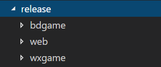

# 用LayaAirIDE创建AS3项目并详解目录结构

> *author: charley   version: LayaAirIDE 2.0.0*   update: 2019-02-18

尽管当前推荐AS3开发者采用FlashDevelop和FlashBuilder环境开发LayaAir引擎的HTML5项目。但是我们建议先通过LayaAirIDE创建项目，再通过FlashDevelop或FlashBuilder打开编辑。通过LayaAirIDE创建项目会默认建立清晰的目录结构。下面我们就以LayaAirIDE工具创建AS3空项目作为开始，带领大家创建项目并介绍项目的结构。


## 一、下载与安装LayaAirIDE

使用LayaAirIDE与LayaAir引擎，需要在游戏中任意可见位置上加上引擎标识：Powered by LayaAir Engine
，对于携带引擎标识的可以免费使用，否则需要联系下载条款中的微信二维码联系商务获得付费授权。

接受条款后下载解压即可使用，IDE是绿色版，无需要安装。IDE中已包含了对应的引擎版本，无需额外下载。

LayaAirIDE2.0 下载地址：https://ldc2.layabox.com/layadownload/?type=layaairide


## 二、用LayaAirIDE创建AS3项目

#### 步骤一：

打开LayaAirIDE，点击`新建`图标或文字，如图1所示，即可进入新建项目界面。

  

（图1）


#### 步骤二：

选择 `LayaAir 2D示例项目` 在填写项目名称、项目路径、以及选择编程语言和引擎版本后，点击“`创建`”即可建立一个新的空项目。如图2所示。

 

 （图2）

#### 额外讲一下可选项：

以下两个选项可以勾选，也可不勾选，开发者理解作用之后自行选择。

##### 1、微信/百度小游戏bin目录快速调试

勾选这个选项后，在创建项目的时候，就会把微信和百度的小游戏工程文件也同时创建到项目调试目录（bin）下面，这样，微信或者百度小游戏开发工具调试项目时，就可以直接指定bin目录为本地调试目录。这样可以节省大量频繁调试的时间，因为调试正式版要发布只导出本地包，每次导出都需要一定的发布时间，会影响调试开发的效率。

##### 2、增加FB/FD项目文件

LayaAirIDE是必不可少的LayaAir引擎的集成开发环境。但是对于AS3的老程序员而言，IDE代码编写模式对于AS3的友好度远不如FlashBuildier(FB)和FlashDevelop（FD），所以AS3默认勾选了该项，勾选该项后，会在创建IDE工程文件的同时也会创建FB和FD工程，方便FB和FD开发环境的项目导入。


#### 步骤三：

在点击“创建”后，可以看到项目的结构，项目文件夹结构如图3所示：

 
（图3）

至此我们已成功的创建了一个AS3项目工程。

*Tips:*

> 对于刚接触LayaAir引擎的开发者，我们推荐创建示例项目，通过示例项目来快速了解完整的项目结构。当然，开发始也可以尝试其它项目类型的创建。


## 三、介绍项目结构

接下来，将会结合上一节中创建的项目结构来介绍每个目录的作用。

### 2.1 项目配置目录（.laya文件夹）

 `.laya` 文件夹下存放的是项目在开发运行中的一些配置信息，如图4所示。

 

（图4）

#### `compile.js` 文件介绍 

`compile.js` 是gulp自定义编译流程的脚本文件，如果开发者对gulp比较熟悉的可以修改，否则不要动这里。

#### `launch.json`文件介绍 

`launch.json` 文件保存了项目调试的一些配置信息,分别是LayaAirIDE的调试配置和chrome浏览器调试配置。不要轻易去改动，改错后会影响项目的调试。

#### `layajs`与`layajs.exe`文件介绍 

`layajs`与`layajs.exe` 都是AS3编译js的编译器，layajs用于mac环境，layajs.exe用于win环境。同时保留是出于多人开发配合的模式下的多环境混用适配。

#### `publish.js`文件介绍

`publish.js`是gulp针对项目发布的脚本文件，开发者不要动这里。

#### **其它说明 **

还有一些配置文件默认没有，但是发布的时候也会保存到.laya目录。比如web版、微信、百度等小游戏，发布后会对应每个不同的类型存生不同的json配置文件，比如wxgame.json是微信小游戏发布配置文件，bdgame.json是百度小游戏发布配置文件。

老版本的发布配置文件名为pubset.json。

以上这些大家有一些了解即可，通常情况下，开发者无需进行修改。所以，不必去深入理解。


### 2.2 项目的输出目录（bin）

 `bin`目录存放的是当前项目的输出文件。如图5所示。

 

(图5)

该目录用于存放项目中输出的js 、HTML、游戏资源等项目运行文件，以及小游戏项目文件（如果创建项目时勾选了小游戏快速调试选项时）。

默认layaAir调试或者chrome调试的时候，就是运行的该目录下的文件。


### 2.3 UI项目目录（laya）

` laya`目录用于存放LayaAirIDE当前的UI项目。

 

(图6)

####  “`assets`” 目录

用来存放UI场景中所需的组件图片、音频文件等资源。

#### “`pages`”目录

用来存放IDE中的场景、动画、预设等配置文件。

#### ​ “`.laya`”文件

注意这个.laya是文件而不是目录，.laya文件是LayaAirIDE的UI项目配置文件。


### 2.4 项目库目录（libs）

 “`libs`”目录内为项目的库目录，用于存放项目使用的LayaAir库文件。

AS语言的LayaAir引擎库文件具体的目录存在`libs/laya/src`下。如图7所示。

 (图7)


### 2.5 项目的源代码目录（src）

项目中的用到的源代码文件（AS3语言项目是.as文件），默认都存放在 src 目录下。

需要特别说一下的是`ui`目录，这里属于IDE自动生成的，开发者不要改动这里，改了也会被下次导出替换。所以该目录中不要存放自己的代码，也不要修改已有代码。

其它的开发者依据实际需要自行规划目录结构即可。示例代码的源代码项目结构如图8所示。

 

（图8）


### 2.6 项目配置文件

  

（图9）

####  `项目名.laya` 

图9中的`2D_DEMO_190218.laya`是LayaAirIDE项目的工程配置文件，文件内记录了当前项目的项目名称、使用的类库版本号等。

​    例如：

```json
{"proName":"2D_DEMO_190218","engineType":1,"proType":0,"layaProType":1,"version":"2.0.0"}
```

#### `项目名.as3proj`

 图9中的`2D_DEMO_190218.as3proj`文件是FlashDevelop项目的工程配置文件。使用 FlashDevelop 编辑器开发AS3项目时，FlashDevelop工具内，在菜单栏通过“文件”->“打开”找到项目名.as3proj所在的目录打开此项目。

#### `.actionScriptProperties`文件和`.project`文件

`.actionScriptProperties`文件和`.project`文件是Flash Builder 项目的配置文件。使用 Flash Builder时，通过菜单栏“文件”->“导入Flash Builder项目”来导入LayaAirIDE创建的AS3项目。

#### `语言版本config.json`

图9中的`asconfig.json`存放着IDE的编译配置信息，勿删。


### 2.7 发布目录

发布目录默认是不存在的，需要点击发布按钮，发布项目后才会生成对应的版本目录，如图10所示。（有专门的发布功能文档介绍，这里不细讲）

 

(图10)

如图10所示的目录结构，就是对应的发布后版本目录。


### 本篇结束语

至此，项目创建的基础内容已介绍完，如果如果想了解更多IDE的介绍或IDE的设计模式，可以查看IDE篇。