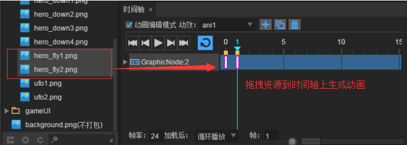

# 二、编辑器可视化资源制作

###游戏可视化资源概述

​	在前一节课程中，我们分析了开发思路，进行了美术素材资源的准备、分类。在这一节课中，先不要急着敲代码，我们制作好UI界面和动画后再进行逻辑处理。LayaAirIDE是一款强大的可视化编辑工具，游戏中可见的部分都可以在IDE中实现。

​       这些可视化的元素包括：各类组件、图标、UI页面、动画、地图、粒子等。如果同学们对IDE组件不是那么熟悉，详细教程可查看“技术文档—LayaAir IDE篇”。下面我们就开始一步一步制作《飞机大战》中的可视化资源。	

### 创建游戏页面

​	在本示例中，我们在项目管理器中依次新建制作开始页面、游戏进行中页面、游戏结束页面和游戏地图页面。（图1、图2）。

​	为适应大众手机屏幕，设置页面分辨率为720X1280。游戏进行中、游戏地图页面我们选择默认View类型页面。Dialog类型带弹出动画效果，因此“开始”与“结束”页面采用此类型。

 （图1）

 （图2）

新建的页面对应说明请参考下表。

| 本游戏IDE可视化文件  | 文件说明              |
| ------------ | ----------------- |
| GameBg.ui    | 游戏滚动的地图，View页面类型  |
| GameOver.ui  | 游戏结束页面，Dialog页面类型 |
| GamePlay     | 游戏进行中页面，View页面类型  |
| GameStart.ui | 游戏开始界面，Dialog页面类型 |

#### 游戏流程页面制作

创建、打开GameStart.ui开始页面后，从资源或组件管理器中拖入相应的组件或资源，通过IDE工具进行位置调整、组合，用IDE层次界面调整元素层级和嵌套关系（类似photoShop图层）。右侧属性栏也可对元素宽高位置、旋转缩放进行操作，最终达到美术效果图所需（图3）。

页面布局调整好后，为需要程序修改的元素加上变量名（var属性）。例如进度加载文本框Text组件var 取名为txt_load，放按钮的Box组件var取名为btn_start。

GamePlay、GameOver页面与GameStart页面制作方式基本相同（图4）（图5），再此不多做描述。

 （图3）

 （图4）

 （图5）

#### 游戏地图背景

创建、打开GameBg.ui页面，我们从资源管理器中拖拽两张background.png到场景编辑器中做背景使用，上下二方连续并对齐，用于地图不停循环滚动使用。并设置两张图变量名（var属性）为bg1、bg2。bg2的y座标为-1280。

当然，只用一张较长的二方连续图也可。有的游戏会在背景上设置两层，一层远景（慢速滚动），一层近景（快速滚动）。

 （图6）

至此，游戏页面制作完成，保存后发布（快捷键F12）。在“代码模式”下我们可以看到在项目...\src目录下生成了ui文件夹，文件夹里是IDE发布生成的4个UI类，在程序中实例化后就可加载到舞台显示出来。

### 游戏页面中的按钮动画

有时为了界面的效果更好，我们可以在一些按钮或界面元素上加上动画效果。比如结束页面中的”重新开始“按钮，点击后可以向上跳动一下。下面我们就以此例来学习一下制作方法。

1.在场景编辑器中选中”重新开始“按钮。然后勾选时间轴界面中的”动画编辑模式“，会出现播放控制按钮及时间轴（图7）。

 （图7）

2.选择在第8帧左右的位置，把按钮向上移动10个像素左右，时间轴上会相应的出现对象名称和两个关键帧。点击对象名称左边小三角，下方会出现y属性，同样有对应的两个关键帧。这是因为我们改变了对象y轴上的属性，当然，如果你改变了其他属性产生动画，例如x、alpha、scaleX等，也会出现在对象名的下方（图8）。

点击对象名称上方播放控制按钮，我们就可以观察到动画了！如果觉得动画过快或过慢，可以鼠标左右移动关键帧到合适的位置。

 （图8）

3.为了达到更丰富的动画效果，选择y轴上第一帧，右侧“帧属性”界面上会出现“是否缓动”选择（图8），勾选后选择缓动类型为elasticOut，那么按钮会带有一种快速回弹的效果。同学们也可以选择其他的缓动进行尝试选择。

最后我们为这个动画修改名称为ani_restart，以方便程序调用。

注：动画编辑器可以制作很多酷炫动画效果。详细教程请查阅“技术文档—LayaAir IDE篇—使用IDE创作”。

### 游戏角色动画

在项目管理器中，右键新建并打开GameRole.ani角色动画（快捷键Ctrl+N），我们用角色资源制作出游戏需要的各种动画资源。

角色动画类型选择默认GraphicAnimation（图9），动画页面大小在游戏中无效，因此根据喜好设置即可，因我们飞机角色为黑白，因此调整参考颜色为非黑。

 （图9）

创建好动画文件后，点开资源管理器中角色资源文件夹gameRole，里面有我们需要制作动画的资源，资源对应当着角色的类型与动画状态。根据需求，我们的角色类型一共分为4种，主角hero，敌人enemy1-3，道具ufo1-2，及子弹bullet1-2。动画状态为飞行fly，受伤hit，死亡down。

如资源名为：hero_down1，代表英雄的死亡状态第一帧动画。在此，我们可以用一个表来清晰说明。

| 状态\角色类型 | 主角（英雄）        | 敌人1            | 敌人2            | 敌人3（boss）      | 道具   | 子弹        |
| ------- | ------------- | -------------- | -------------- | -------------- | ---- | --------- |
| 飞行      | hero_fly1 -2  | enemy1_fly1    | enemy2_fly1    | enemy3_fly1-2  | ufo1 | bullet1-2 |
| 受伤      | 无             | 无              | enemy2_hit1    | enemy3_hit1    |      |           |
| 死亡      | hero_down1 -4 | enemy1_down1-4 | enemy2_down1-4 | enemy3_down1-4 |      |           |

创建角色动画方法与步骤

1.勾选动画编辑器界面中“动画编辑模式”，将出现播放控制按钮及时间轴（图10）。

 （图10）

2.在资源管理器中选中单张或多张动画资源图片，拖拽至时间轴上生成动画（图11）。

 例如创建主角飞行动画，选中hero_fly1、hero_fly2两张图拖拽至时间轴上，就生成了主角的飞行动画，打开循环按钮，再点击播放可观察到效果，如觉得动画过快或慢，可调节帧率或两帧间的间隔。

 （图11）

3.在场景编辑器中调整动画资源居中到动画原点。在项目程序中，角色碰撞是按角色中心半径计算，因此需把角色动画的中心调整到原点，可以少写一些代码（图10）。

帧率为动画文件本身播放频率，游戏程序中的主频帧率不会干扰影响，本例中所有动画不调整帧的时间间隔，只设置帧率为12帧即可。

注：加载后播放状态只在动画直接放置到UI中有效，程序加载动画需用动画的play()方法播放（图10）。

 （图10）

4.修改动效名称。IDE中动效名称默认为ani_0，不方便在游戏程序中使用，需修改成组合名称，用于区别角色类型和动画状态。

动画切换时用play()方法切换动画，例如下图中名称hero_fly、hero_die，调用 hero.play(0,true,"hero_fly")播放主角飞行动画。调用hero.play(0,true,"hero_die")时播放主角死亡动画。

在本例中，因动画资源不大，因此我们将所有的角色动画都存放在GameRole.ui中，包括主角、敌人、子弹和道具。点击“添加”按钮后，出现新的空时间轴，重复上述4个步骤即可制作完成所有角色动画动效。添加后的动效将出现在动效下拉列表中，选择某其中某个动画可进行重新编辑（图11）。

 （图11）

综上所述，在本节课中我们制作了全部的游戏可视化素材，为游戏后序开发打好了基础。在项目开发过程中，UI界面变动修改较多，这时也可以让美术岗位的同事来学习IDE页面及动画的制作，提高工作效率。美术完成后程序再作一些简单调整就可以发布，并进行UI逻辑处理了。