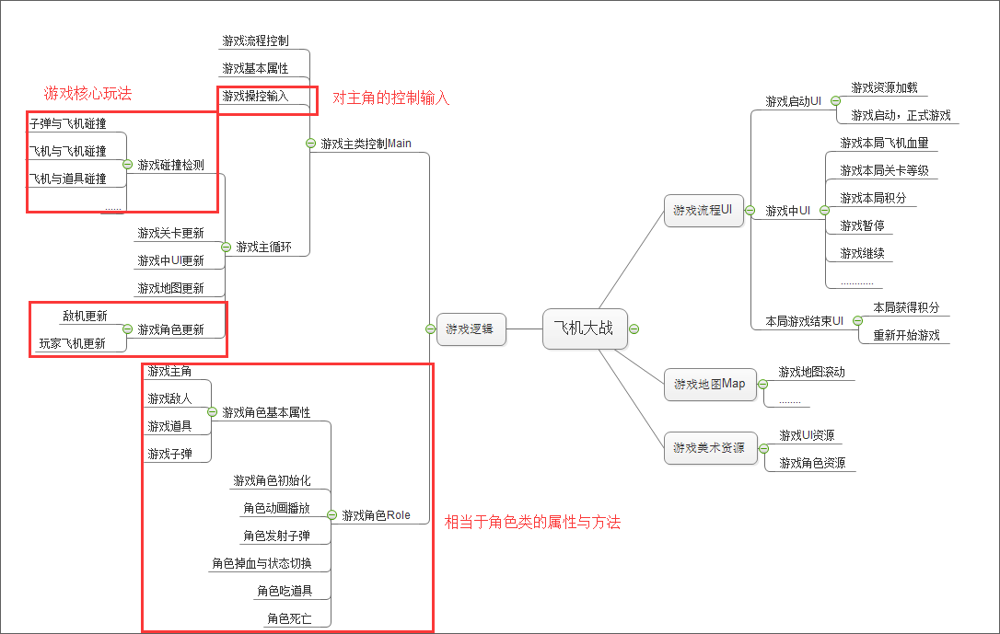

# 五、游戏主角与操控

###游戏角色概述

​	在上几节课中，我们用IDE创建了UI，并实现了游戏的流程管理与UI逻辑功能。但最重要的角色还未加入，根据思维导图分析，游戏角色才是游戏的真正核心逻辑（图1）。本节课中，我们将实现游戏主角的部分功能，让主角可以操控起来。

<br />（图1）

本节课的制作思路为：

1.建立基础角色类，可通过初始化方法对角色进行分类，根据角色类型可播放不同的动画。
2.在主类中实例化主角，并实现主角的控制方法，让主角移动。
3.建立主角更新方法，并作边界检查，使主角不能移动画屏幕外。


### 游戏基础角色类的建立

在src目录下新建一个角色类Role.as，继承显示类Sprite（laya.display.Sprite）。

角色类中我们主要实现逻辑为：

1.角色的基本属性：角色类型type、血量hp、速度speed。

2.角色动画对象roleAni:Animation，用于播放IDE编辑的角色动画。
 注：加载角色图集资源已在开始页面逻辑中完成，因此只需加载IDE编辑的动画资源gameRole.ani即可。

3.角色初始化公共方法init()，对角色进行类型、血量、和速度进行初始化，对角色分类。

4.角色动画播放方法playAction(action:String)，可切换角色类型与动画状态。

 具体代码如下：


```
package
{
	import laya.display.Animation;
	import laya.display.Sprite;
	import laya.events.Event;
	import laya.maths.Rectangle;
	
	/**
	 * @author CHENZHENG
	 * 角色类，飞机、敌人、子弹、道具
	 */	
	public class Role extends Sprite
	{
		/***角色的类型   “hero”:玩家飞机，“enemy”：敌人飞机、“bulle”：子弹、"ufo":道具****/
		public var type:String;
		/***角色的血量***/
		public var hp:Number=0; 
		/***角色的速度***/
		private var speed:Number=0;		
		
		/***角色的动画***/
		private var roleAni:Animation;
		/***当前动画动作***/
		private var action:String;
		
		public function Role()
		{
			//实例化动画
			roleAni=new Animation();
			//加载IDE编辑的动画文件
			roleAni.loadAnimation("GameRole.ani");
		}
		
		/**
		 * 角色初始化
		 * @param type  角色类型：“hero”:玩家飞机，“enemy1-3”：敌人飞机、“bulle:1-2”：子弹、"ufo1-2":道具
		 * @param hp   血量
		 * @param speed  速度
		 */		
		public function init(type:String,hp:Number,speed:Number):void
		{
			//初始化角色属性
			this.type=type;
			this.hp=hp;
			this.speed=speed;
			//加载动画对象
			this.addChild(roleAni)
			//播放默认飞行动画
			playAction("fly");
		}
		
		/**
		 * 播放动画 
		 * @param action 动画状态："fly"、"hit"、"die"
		 */	
		public function playAction(action:String):void
		{
			this.action=action;
			//播放角色动画,name=角色类型_动画状态，如：hero_fly
			roleAni.play(0,true,this.type+"_"+action);
		} 
		
}
```


当我们建立好角色类，就可以在主类中创建主角飞机了。我们需要在main类中加入以下逻辑：

1.新增单独的角色层容器roleLayer，所有角色都加载入其中，以方便后期实现角色管理，例如角色碰撞逻辑等。当然，游戏结束时在gameOver()方法中需清空角色层，为下一局游戏做准备。

2.创建主角全局变量hero，并在游戏gameInit()方法中实例化主角，在角色层中显示出来。

3.在游戏线束方法gameOver()中，移除角色层。重新实例化时所有角色会全部去除，为下一次游戏做准备。

代码参考如下：

```
		......
		/**角色层容器***/
		private var roleLayer:Sprite;
		/**玩家主角***/
		private var hero:Role;
		......

		/**
		 游戏中，游戏初始化
		 */
		private function gameInit():void
		{
			......
			//实例化角色层并加载到舞台(如果已实例化，不需要重新new)
			roleLayer||=new Sprite();
			Laya.stage.addChild(roleLayer)
				
			//实例化游戏中UI页面(如果已实例化，不需要重新new)
			play||=new GamePlay();			
			//加载到舞台
			Laya.stage.addChild(play);
						
			//实例化主角(如果已实例化，不需要重新new)
			hero||=new Role()
			//初始化角色类型、血量，注：速度speed为0，因为主角是通过操控改变位置
			hero.init("hero",10,0);
			//主角位置修改
			hero.pos(360,800);
			//角色加载到角色层中
			roleLayer.addChild(hero);
			......
		}
		
        /**
		 游戏结束
		 */
		private function gameOver():void
		{
			......
			//清空角色层子对象
			roleLayer.removeChildren(0,roleLayer.numChildren-1);
			//移除角色层
			roleLayer.removeSelf();
			......
		}
		
```


完成上述逻辑代码后，我们发现主角飞机已经加载到屏幕上了，并播放了飞行动画。


### 游戏主角的操控

在之前的《飞机大战》游戏教程中，手指滑动，主角自动对齐手指跟随移动。这种操作有一个明显的不足之处，玩家如果手指较粗大，那么飞机就被挡住了，不利于观察。当手指离开再触摸其他位置时，飞机还会瞬移过去，不符合常理。

因此，我本节课中，我们会把操控输入方式修改成手指移动，飞机并不会瞬移到手指下，只是根据移动方向和速度进行自身座标改变。

注：LayaAir引擎没有像Flash中把触摸事件（TouchEvent）独立出来，我们可以直接用鼠标事件监听（MouseEvent）的方式识别玩家触摸操作。它也包括多点触摸属性。

因没有角色死亡，为了操控时间加长，我们把主类gameInit()方法中，模拟延迟3秒游戏结束修改成延迟30秒。

```
		//模拟游戏结束，30秒时间
		Laya.timer.once(30000,this,gameOver);
```

其他码逻辑思路如下：

1.增加两个属性moveX，moveY，用于记录每次手指移动后，上一帧的触摸位置。

2.在gameInit()方法中，增加舞台鼠标按下、鼠标移动、鼠标抬起监听事件。并且在按下时监听鼠标移动，在抬起时移除移动监听。当然，在游戏结束时，需把舞台监听全部去除。

3.在鼠标移动的方法onMouseMove()中更新主角位置，移动的位置为当前触摸位置减去上一帧触摸的位置。

4.在角色中增加更新方法update()，这个方法中暂时只加入主角的边界检查，使其不能移动到屏幕外。以后还有其他逻辑加入，如角色血量检查、敌机超出边界处理等。

Main中修改参考代码：

```
		......
        /**鼠标上一帧x座标** */		
		private var moveX:Number;
		/**鼠标上一帧y座标** */	
		private var moveY:Number;
		
		......
		/**
		 游戏中，游戏初始化
		 */
		private function gameInit():void
		{
			......
			//角色加载到角色层中
			roleLayer.addChild(hero);
			
			//鼠标按下监听
			Laya.stage.on(Event.MOUSE_DOWN,this,onMouseDown);
			//鼠标抬起监听
			Laya.stage.on(Event.MOUSE_UP,this,onMouseUp);
			......			
		}
		
		/**
		 按下后开始触发移动
		 */	
		private function onMouseDown():void
		{
			//鼠标按下时的位置，用于计算手指移动量
			moveX=Laya.stage.mouseX;
			moveY=Laya.stage.mouseY;
			//开始移动监听
			Laya.stage.on(Event.MOUSE_MOVE,this,onMouseMove);
		}
		
		/**
		 主角跟随鼠标移动
		 */	
		private function onMouseMove():void
		{
			//计算角色移动量(上一帧的位置—当前移动到的位置)
			var xx:Number=moveX-Laya.stage.mouseX;
			var yy:Number=moveY-Laya.stage.mouseY;
			//更新移动位置
			hero.x-=xx;
			hero.y-=yy;
			//更新前一帧位置的座标
			moveX=Laya.stage.mouseX;
			moveY=Laya.stage.mouseY;
		}
		/**
		 鼠标抬起、关闭移动监听
		 */		
		private function onMouseUp():void
		{
			Laya.stage.off(Event.MOUSE_MOVE,this,onMouseMove) ;
		}
		
		/**
		 游戏结束
		 */
		private function gameOver():void
		{
			//移除所有舞台事件，鼠标操控
			Laya.stage.offAll();
			......
		}
```


### 主角边界检查更新

编译运行，发现手指在屏幕上移动时，飞机也移动了，而不会一下跑到手指下面。但新问题也出现了，因为主角飞机没有强行同步对齐至手指，所以移动过多时，飞机会飞出屏幕之外。 

在角色中增加边界检查功能，新增update()方法，具体代码如下：

```
		......
		
		/**
		 * 角色更新,边界检查
		 */		
		public function update():void
		{
        	//主角边界检查
			if(this.type=="hero")
			{
				//需减去角色宽或高的一半，因为在IDE中制作动画时，我们把角色的中心做为了角色对象的原点
				//判断是否左右超出
				if(this.x<roleAni.width/2)
				{
					this.x=roleAni.width/2;
				}
				else if(this.x>720-roleAni.width/2)
				{
					this.x=720-roleAni.width/2;
				}
				//判断是否上下超出
				if(this.y<roleAni.height/2)
				{
					this.y=roleAni.height/2;
				}
				else if(this.y>1280-roleAni.height/2)
				{
					this.y=1280-roleAni.height/2;
				}
			}
		}
		......
```


在角色中增加了更新方法后，在主类Main主循环loop()中调用执行主角update()方法，每一帧都判断是否超界。

```
		......
		/**
		 游戏主循环
		 */
		private function loop():void
		{
			//地图滚动更新
			map.updateMap()
			//本局游戏数据更新
			play.update(hp,level,score)
				
			//调用主角更新，边界检查等
			hero.update();
		}

		......
```


到此，编译运行后，我们需要的效果达成了吗？细心的同学发现还是未达成，角色移动到边界时，动画中心点外的部分还是超出屏幕外了，那么这是什么原因造成的呢？我们明明在边界检查的时候减去了角色动画一半的宽度或高度，但运行起来无效。

在边界检查处加入trace("角色宽高："+roleAni.width,roleAni.height)代码，运行后，按F12快捷键打开调试模式，我们可以看到控制台输出为“角色宽高：0 0”（图2）。

<br />（图2）

哪怕是7000帧后也为0,0，那么这是什么原因呢？

这是因为动画加载后，只有真正完成一次动画，再通过获取动画对象矩形边界的方法才能获得其宽高属性。那我们处理的方法为：在角色类初始化init()方法中，加入角色“动画播放完成”的监听事件，并建立回调方法来获得宽高！代码参考如下：

```
			......
			
			//加载动画对象
			this.addChild(roleAni)
						
			//监听动画播放完成事件
			roleAni.on(Event.COMPLETE,this,onComplete)
			//播放默认飞行动画
			playAction("fly");

		}
		
		/***动画完成后回调方法***/
		private function onComplete():void
		{
			//如果角色还未有宽，获得角色宽高	
			if(roleAni.width==0)
			{
				//获得动画矩形边界
				var bounds:Rectangle=roleAni.getBounds();
				//角色宽高赋值
				roleAni.size(bounds.width,bounds.height)
			}
		}
		
		......	
```

加入以上代码后编译运行，游戏主角得到了完美的控制，再也不超出边界了！

<br />（图1）


本节课修改后的全部代码如下：

### 主类Main.as全部代码

```
package {
	
	import laya.display.Sprite;
	import laya.display.Stage;
	import laya.events.Event;
	import laya.net.Loader;
	import laya.utils.Handler;
	import laya.webgl.WebGL;
	
	
	public class Main
	{
		/**开始页面***/
		private var start:GameStart
		/**地图页面***/
		private var map:GameMap
		/**游戏中界面***/
		private var play:GamePlay
		/**游戏结束页面***/
		private var over:GameOver
		
		/**主角血量***/
		private var hp:int=10;
		/**游戏关卡数***/
		private var level:int=1;
		/**玩家得分***/
		private var score:int=0;
		
		/**角色层容器***/
		private var roleLayer:Sprite;
		/**玩家主角***/
		private var hero:Role;
		
		
		/**鼠标上一帧x座标** */		
		private var moveX:Number;
		/**鼠标上一帧y座标** */	
		private var moveY:Number;
		
		public function Main()
		{
			//初始化引擎，建议增加WebGl模式
			Laya.init(720, 1280,WebGL);
			//全屏不等比缩放模式
			Laya.stage.scaleMode = Stage.SCALE_EXACTFIT;
			//加载游戏页面资源(如果界面资源太多太大[超过50k],建议开始页面单独建立文件夹打包)
			Laya.loader.load("res/atlas/gameUI.atlas",Handler.create(this,this.gameStart));
				
		}
		
		/**
		 资源加载完成后，加载游戏开始界面
		 */
		private function gameStart():void
		{
			//实例化开始页面
			start=new GameStart();
			//以弹出方式打开，有缓动效果。IDE中页面为Dialog才可用
			start.popup();
			//监听开始游戏开始按钮事件,点击后进入游戏中
			start.btn_start.on(Event.MOUSE_UP,this,gameInit);
		}
		
		/**
		 游戏中，游戏初始化
		 */
		private function gameInit():void
		{
			//缓动动画关闭效果。IDE中页面为Dialog才可用
			start.close();
			
			//实例化地图背景页面(如果已实例化，不需要重新new)
			map||=new GameMap();
			//加载到舞台
			Laya.stage.addChild(map);
			
			//实例化角色层并加载到舞台(如果已实例化，不需要重新new)
			roleLayer||=new Sprite();
			Laya.stage.addChild(roleLayer);
				
			//实例化游戏中UI页面(如果已实例化，不需要重新new)
			play||=new GamePlay();			
			//加载到舞台
			Laya.stage.addChild(play);
						
			//实例化主角(如果已实例化，不需要重新new)
			hero||=new Role();
			//初始化角色类型、血量，注：速度speed为0，因为主角是通过操控改变位置
			hero.init("hero",10,0);
			//主角位置修改
			hero.pos(360,800);
			//角色加载到角色层中
			roleLayer.addChild(hero);
			
			//鼠标按下监听
			Laya.stage.on(Event.MOUSE_DOWN,this,onMouseDown);
			//鼠标抬起监听
			Laya.stage.on(Event.MOUSE_UP,this,onMouseUp);
			
			
			//模拟游戏结束，15秒时间
			Laya.timer.once(15000,this,gameOver);
			//游戏主循环
			Laya.timer.frameLoop(1,this,loop);
		}
		
		/**
		  按下后开始触发移动
		 */	
		private function onMouseDown():void
		{
			//记录鼠标按下时的位置，用于计算鼠标移动量
			moveX=Laya.stage.mouseX;
			moveY=Laya.stage.mouseY;
			//
			Laya.stage.on(Event.MOUSE_MOVE,this,onMouseMove);
		}
		
		/**
		 主角跟随鼠标移动
		 */	
		private function onMouseMove():void
		{
			//计算角色移动量
			var xx:Number=moveX-Laya.stage.mouseX;
			var yy:Number=moveY-Laya.stage.mouseY;
			//更新移动位置
			hero.x-=xx;
			hero.y-=yy;
			//更新本帧的移动座标
			moveX=Laya.stage.mouseX;
			moveY=Laya.stage.mouseY;
		}
		/**
		 鼠标抬起、关闭移动监听
		 */		
		private function onMouseUp():void
		{
			Laya.stage.off(Event.MOUSE_MOVE,this,onMouseMove) ;
		}
		
		
		/**
		 游戏主循环
		 */
		private function loop():void
		{
			//地图滚动更新
			map.updateMap();
			//本局游戏数据更新
			play.update(hp,level,score);
				
			//如果主角未死亡，调用主角更新，边界检查
			if(hero.hp>0)
			{
				hero.update();
			}
		}

		/**
		 游戏结束
		 */
		private function gameOver():void
		{
			//移除所有舞台事件，鼠标操控
			Laya.stage.offAll();
			
			//移除地图背景
			map.removeSelf();
			//移除游戏中UI
			play.removeSelf();
			
			//清空角色层子对象
			roleLayer.removeChildren(0,roleLayer.numChildren-1);
			//移除角色层
			roleLayer.removeSelf();
			
			//去除游戏主循环
			Laya.timer.clear(this,loop);
			
			//实例化游戏结束页面
			over||=new GameOver();
			//游戏积分显示
			over.txt_score.text=score.toString();
			//以弹出方式打开，有缓动效果。IDE中页面为Dialog才可用
			over.popup();
			//重新开始事件监听,点击后进入游戏中
			over.on("reStart",this,gameInit);
		}
	}
}
```


### 角色类Role全部代码

```
package
{
	import laya.display.Animation;
	import laya.display.Sprite;
	import laya.events.Event;
	import laya.maths.Rectangle;
	import laya.utils.Handler;
	
	/**
	 * @author CHENZHENG
	 * 角色类，飞机、敌人、子弹、道具
	 */	
	public class Role extends Sprite
	{
		/***飞机的类型   “hero”:玩家飞机，“enemy”：敌人飞机、“bulle”：子弹、"ufo":道具****/
		public var type:String;
		/***飞机的血量***/
		public var hp:Number=0; 
		/***飞机的速度***/
		private var speed:Number=0;		
		
		/***角色的动画资源***/
		private var roleAni:Animation;
		/***当前动画动作***/
		private var action:String;
		
		public function Role()
		{
			//实例化动画
			roleAni=new Animation();
			//加载IDE编辑的动画文件
			roleAni.loadAnimation("GameRole.ani");
		}
		
		/**
		 * 角色初始化
		 * @param type  角色类型：“hero”:玩家飞机，“enemy1-3”：敌人飞机、“bulle:1-2”：子弹、"ufo1-2":道具
		 * @param hp   血量
		 * @param speed  速度
		 */		
		public function init(type:String,hp:Number,speed:Number):void
		{
			this.type=type;
			this.hp=hp;
			this.speed=speed;
			//加载动画对象
			this.addChild(roleAni)
			
			//监听动画完成事件
			roleAni.on(Event.COMPLETE,this,onComplete)
			//播放默认飞行动画
			playAction("fly");

		}
		
		/***动画完成后回调方法***/
		private function onComplete():void
		{
			//如果角色还未有宽，获得角色宽高	
			if(roleAni.width==0)
			{
				//获得动画矩形边界
				var bounds:Rectangle=roleAni.getBounds();
				//角色宽高赋值
				roleAni.size(bounds.width,bounds.height)
			}
		}
		
		/**
		 * 播放动画 
		 * @param action 动画状态   "fly"、"hit"、"die"
		 */	
		public function playAction(action:String):void
		{
			this.action=action;
			//播放角色动画,name=角色类型_动画状态，如：hero_fly
			roleAni.play(0,true,this.type+"_"+action);
		} 
		
		/**
		 * 角色更新,边界检查
		 */		
		public function update():void
		{
			//主角边界检查
			if(this.type=="hero")
			{
				//需减去角色宽或高的一半，因为在IDE中制作动画时，我们把角色的中心做为了角色对象的原点
				//判断是否左右超出
				if(this.x<roleAni.width/2)
				{
					this.x=roleAni.width/2;
				}
				else if(this.x>720-roleAni.width/2)
				{
					this.x=720-roleAni.width/2;
				}
				//判断是否上下超出
				if(this.y<roleAni.height/2)
				{
					this.y=roleAni.height/2;
				}
				else if(this.y>1280-roleAni.height/2)
				{
					this.y=1280-roleAni.height/2;
				}
			}
		}
	}
}
```