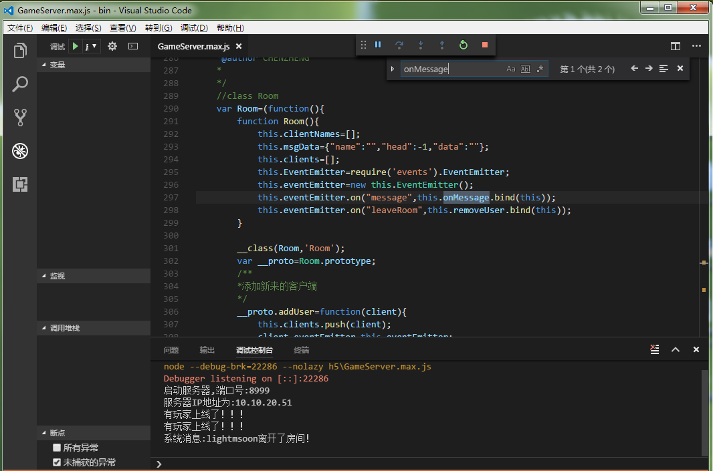

# 图文混排聊天室之WebSocket服务器

　　LayaAir引擎在设计之初时，虽然主要用于游戏的客户端开发，但是随着nodejs的盛行，加上LayaAir编译的最终文件为js语言。那么用LayaAir支持的AS、TS语言开发服务器也是一种很不错的选择，它让我们的客户端程序也能前后端同时开发！变成全栈工程师。并且ES5面向过程的那种写法已经越来越难维护，用面向对象的语言来开发显得更为重要。

​	本例中我们就用AS3.0语言来开发一套图文混排聊天室，它包括了前后端的开发教程。这节课我们先讲解以AS3.0来开发nodejs WebSocket聊天服务器的课程，并用layaAir进行编译生成nodejs可运行的服务器代码。


### 下载并安装nodejs

　　开发nodejs当然少不了nodejs的安装。从官网[https://nodejs.org/en/](https://nodejs.org/en/) 下载nodejs的稳定版本。然后基本一路next安装就行。安装完毕，打开cmd 输入`node -v` 假如显示相应得到版本信息就表明安装成功（图1）。关于nodejs的详细信息这里就不在阐述了，可参考nodejs中文网API文档进行了解，网址为http://nodejs.cn/api/。

  <br/>（图1）


### 下载nodejs服务端WS模块

在开发即时聊天服务器时，node服务端的websocket模块需要用第三方模块，这里我们选用ws模块即可（开发者可换成自己熟悉的第三方模块）。

打开cmd ，进入想要存放ws的目录，输入`npm install ws `回车。我们可以看到以下提示（图2）。这说明我们下载成功，我们下载到了E盘下的tools目录下，下载生成的目录名为：node_modules，里面包括了ws等文件。

<br/>（图2）


### 新建服务器项目

在Flash Builder中新建名为GameServer的Actionscript项目，并修改启动类GameServer.as，去掉继承Sprite的代码，服务器端在node中运行，所以不需要继承显示类。
````java
package
{
	/**
	 *聊天室服务器 
	 */	
	public class GameServer
	{
		public function GameServer()
		{
			
		}
	}
}
````
用LayaAir编译运行，可以看到在bin_debug下生成了h5目录及相应的js文件。将我们下载安装ws时生成的目录node_modules拷贝到h5目录中，以供服务器程序调用。


### AS3调用nodejs原生模块方法

在nodejs中，有较多的模块，比如在本课中会使用到的ws、events、os（详情参考nodejsAPI），js中需要使用时必须导入。原生js调用webSocket方法参考以下代码：

```
// 导入WebSocket模块:
const WebSocket = require('ws');
// 引用Server类:
const WebSocketServer = WebSocket.Server;
// 实例化:
const wss = new WebSocketServer({ port: 3000});
```

上述代码中，通过require()方法导入webSocket模块，然后再实例化使用。那么用LayaAir可编译的AS3.0语言怎么使用呢？

观察以下代码，我们运用了LayaAir支持的AS3语言方法`__JS__()`，它可以导入使用原生的js方法，导入并生成类（或对象），然后就可实例化使用。

```
		/***导入nodeJs原生WebSocket模块中的Server***/
		const WebSocketServer:Object = __JS__("require('ws').Server");
		
		//创建服务器，端口号设置为8999
		const server:Object = new WebSocketServer({ port: 8999 });
```
```
		//导入nodejs原生os系统操作模块
		var os:Object =__JS__("require('os')")
		
		//获得网络接口列表。
		var ifaces:Object = os.networkInterfaces();
```

在本节课中，我们所有需要使用原生js方法的地方，都使用了`__JS__()`。


### 聊天服务器的架设

#### 服务器需求分析

当完成nodejs服务器的准备工作，了解了AS3怎么调用js原生方法后，我们开始聊天服务器的正式架设。首先简单分析一下需求（图3）。

1.主类GameServer，建立socket服务器，识别本机IP地址，并监听客户端的连接。

2.房间类Room，用于管理连接的客户端，包括客户端的加入、离开、广播、客户端列表更新等。

3.客户端类Client，每连接一个客户端，服务器会生成一个长连接镜像，进行收发消息。

<br/>（图3）

#### 主类GameServer

主类比较简单，导入了ws模块用于建立服务器，及导入os模块用于检测服务器的硬件网络IP信息等。并监听是否有客户端连接，连接后生成一个带镜像socket客户端Client。

注意监听中加入了js原生bind(this)的方法，在此我们因未使用LayaAir引擎，因此需加入js原生方法绑定作用域，否则方法中的全局对象会找不到。

主类逻辑代码如下：

```
package
{
	public class GameServer
	{
		/**新建一个聊天房间 ***/		
		private var room:Room = new Room();
		
		/***导入第三方ws原生WebSocket服务器模块***/
		private const WebSocketServer:Object = __JS__("require('ws').Server");
		
		/***webSocket服务器***/
		private var server:Object;
		
		public function GameServer()
		{
			///创建服务器，端口号设置为8999
			server = new WebSocketServer({ port: 8999 });
			trace("启动服务器,端口号:"+8999);
			trace("服务器IP地址为:"+IP);
			//服务器监听客户端连接事件(需加js原生的作用域绑定bind(this))
			server.on('connection',connectionHandler.bind(this));
		}
		
		/**
		 * 有客户端连接成功
		 * @param webSocket 连接时会分配一个客户端的webSocket镜像
		 */		
		private function connectionHandler(webSocket:Object):void
		{
			trace("有玩家上线了！！！")
			//新的客户端连接服务器，创建client类
			var client:Client = new Client(webSocket);
			//添加到房间
			room.addUser(client);
		}
		
		/**
		 * 获取本机的ip地址 
		 */		
		private function get IP():String
		{
			//导入nodejs原生os系统操作模块
			var os:Object =__JS__("require('os')")
			//获得网络接口列表。
			var ifaces:Object = os.networkInterfaces();
			//本机IP地址
			var ip:String= '';
			//遍历网络接口,获得本机ip地址
			for (var dev:String in ifaces)
			{
				//有多种接口，包括物理地址、IP地址等
				var info:Object=ifaces[dev]
//				trace(info)
				for(var i:String in info)
				{
					if (ip === '' && info[i].family === 'IPv4' && !info[i]["internal"])
					{
						ip = info[i].address;
						return ip;
					}
				}
			}
			return ip;
		}
	}
}
```


#### 房间管理类Room

本类的主要作用是客户端的管理，一般的聊天室中会创建很多这种房间，比如“群”就相当于房间，多个群就是多个房间，在本课中我们只建立了一个房间，同学们可以在此基础上进行扩展。

除房间普通需求，如新加入房间、离开房间、接收消息需求外，需注意以下逻辑：

1.客户端昵称列表clientNames主要用于客户端检测重名、更新用户列表使用。

2.房间类中导入了nodejs事件发射器模块EventEmitter，用于事件监听与数据传递，它在服务器级别上比LayaAir引擎中的event效率更高，因此建议用原生。

3.在编写逻辑代码前，需要对消息进行格式分类，前后端统一，建议单独创建消息类进行管理。
在本课中消息较少，分为登录消息、聊天消息（包括系统消息）、用户列表消息三种，因此暂未建立消息类。

Room类代码如下：

```
package
{
	/**
	 *客户端房间管理 
	 * @author CHENZHENG
	 * 
	 */	
	public class Room
	{
		/***所有客户端的连接 */		
		public var clients:Array = [];
		/***所有客户端昵称列表**/
		public var clientNames:Array=[];
			
		/***原生nodejs的事件发送模块***/		
		public var EventEmitter:Object =__JS__("require('events').EventEmitter");
		
		/**webSocket事件发送者***/
		public var eventEmitter:Object=new EventEmitter();
		
		/****定义一个简单的消息体（注：-1为系统头像）****/
		public var msgData:Object ={"name":"","head":-1,"data":""};
		
		public function Room()
		{
			//监听消息产生事件(js原生的作用域绑定bind(this))
			eventEmitter.on("message",onMessage.bind(this));
			//监听离开房间事件(js原生的作用域绑定bind(this))
			eventEmitter.on("leaveRoom",removeUser.bind(this));
		}
		/**
		 * 添加新连接的客户端 
		 */		
		public function addUser(client:Client):void
		{
			//加入一个客户端
			this.clients.push(client);
			//客户端消息事件对象，用于发送消息
			client.eventEmitter=this.eventEmitter;
			
			//给新客户端发送在线用户列表（用于判断是重名和更新用户列表）
			var msgClients:Object={"clients":this.clientNames}
			//发送用户列表
			client.webSocket.send(JSON.stringify(msgClients))
		}
		/**
		 *移除房间用户 
		 */		
		private function removeUser(client:Client):void
		{
			//查找离开的客户端昵称索引
			var index:int=clientNames.indexOf(client.clientName);
			//如果找到
			if(index!=-1)
			{
				//删除离开的客户端昵称
				clientNames.splice(index,1);
			}
			
			//查找客户端索引
			var index1:int = this.clients.indexOf(client);
			//如果找到
			if(index1!=-1)
			{	
				//删除离开的客户端
				this.clients.splice(index1,1);
				//离开消息提示
				trace("系统消息:"+client.clientName+"离开了房间！");
				msgData.name ="系统";
				msgData.head=-1;
				msgData.data = "“"+client.clientName+"”离开了我们的房间！！";
				//系统广播离开消息
				this.broadcast(JSON.stringify(msgData));
			}
			
			//更新用户昵称列表
			updateClientNames();
		}
		
		/**
		 *接收到消息
		 */
		private function onMessage(msg:Object):void
		{
			//接收的消息分为两类：登录用户昵称消息，对话消息
			//如果是刚连接的消息,更新客户端名称，并发出欢迎消息
			if(msg.hasOwnProperty("login"))
			{
				//连接提示消息
				msgData.name="系统";
				msgData.head=-1;
				msgData.data ="欢迎“"+msg.name+"”加入我们的房间！！";
				this.clientNames.push(msg.name);
				//更新用户昵称列表（向所有人广播）
				updateClientNames();
			}else//否则直接使用对话消息
			{
				//直接生成对话消息体
				msgData.name = msg.name;
				msgData.head=msg.head;
				msgData.data = msg.data;
			}
			
			//系统广播对话消息或欢迎消息
			this.broadcast(JSON.stringify(msgData));
		}
		
		/**
		 * 广播消息 
		 * @param msg 发送的消息字符串
		 */		
		public function broadcast(msg:String):void
		{
			//获取客户端总数
			var len:int = this.clients.length;
			var client:Client;
			//遍历所有客户端并发送消息
			for(var i:int = 0;i<len;i++)
			{
				client =this.clients[i];
				client.webSocket.send(msg);
			}
		}
		/**
		 * 新增用户昵称并广播给所有人
		 * @param clientName 新增的用户昵称
		 */		
		public function updateClientNames():void
		{
			//用户列表信息
			var msgClients:Object={"clients":this.clientNames};
			//广播给所有客户端
			broadcast(JSON.stringify(msgClients));
		}
	}
}
```


#### 客户端类Client

当前端连接上服务器后，服务器会生成一个前端的客户端镜像，它有与前端一样的socket，消息接收与发送就是在它们两兄弟间进行。因此Client类的作用主要为监听消息事件和客户端断开事件，然后通知房间去处理后续逻辑。

Client类代码如下：

```
package
{
	/**
	 *服务器端被连接时产生的客户端镜像 
	 * @author CHENZHENG
	 */	
	public class Client
	{
		/***客户端镜像socket**/
		public var webSocket:Object;
		/***原生nodejs事件发送者***/
		public var eventEmitter:Object;
		/***连接的客户端名称***/
		public var clientName:String="";
		/***消息体（注：-1为系统头像）***/
		private var  msgData:Object ={"name":"","head":-1,"data":""};
		
		public function Client(webSocket:Object)
		{
			//socket实例
			this.webSocket = webSocket;			
			//客户端消息监听(需加js原生的作用域绑定bind(this))
			this.webSocket.on("message",messageHandler.bind(this));
			//客户端断开监听(需加js原生的作用域绑定bind(this))
			this.webSocket.on("close",closeHandler.bind(this));
		}
		/**
		 * 接收客户端发送过来消息 
		 * @param msg
		 */		
		public function messageHandler(msg:String):void
		{
			//消息转化成obj
			var obj:Object=JSON.parse(msg);
			//更新客户端名称
			this.clientName=obj.name;
			//客户端有消息到,相当于layaAir引擎中的事件发送，可带数据
			eventEmitter&&eventEmitter.emit("message",obj);
		}
		/**
		 * 客户端断开连接 
		 */		
		public function closeHandler():void
		{
			//发送客户端离开消息
			eventEmitter&&eventEmitter.emit("leaveRoom",this);
		}
	}
}
```


### 编译运行服务器

当实现了服务器的架设后，编译代码！打开cmd，进入到*bin-debug/h5*目录下。**node**运行我们编译好的*GameSever.max.js*文件，可以看到服务器已经运行起来（图4）。

<br/>（图4）


当然，在cmd中运行调试不太方便，如果遇到代码错误，也无法打断点调试，因此建议同学们下载Visual Studio Code运行服务器，支持代码查看查询和断点调试！（图5）

<br/>（图5）

本节课到此全部结束，上面的代码还是否有逻辑问题，可以编写客户端的过程中进行检验。

