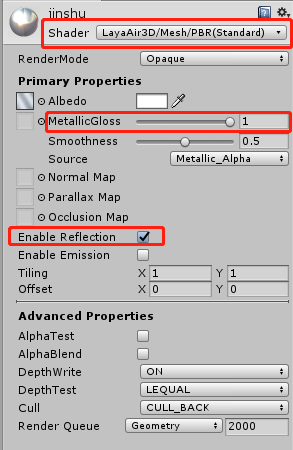
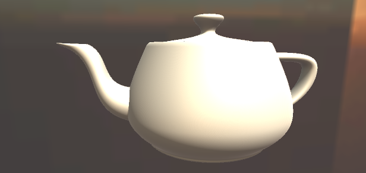
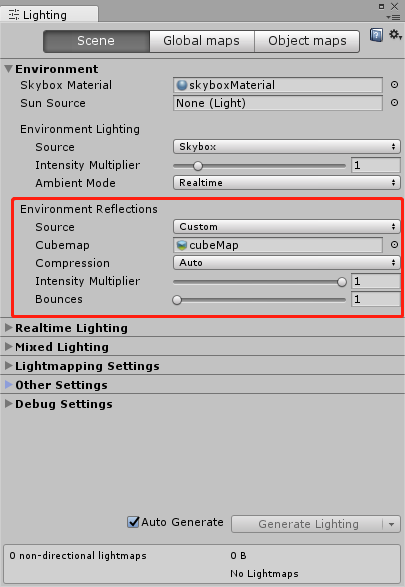
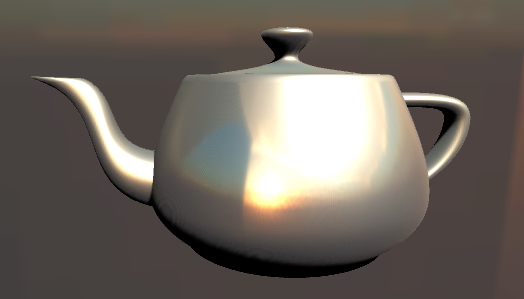
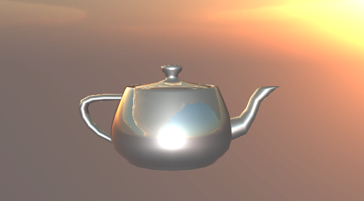

# 场景环境反射

###### *version :2.0.1beta   Update:2019-3-19*

​	场景环境反射分两种，天空盒反射与自定义反射。想要有反射效果就必须Shader中如果没有反射材质也是没有效果的，默认的BlinnPhong不支持，PBR材质是支持环境反射。关于环境反射更多的是推荐在Unity中设置好后再导出使用。

天空盒反射:直接反射指的是材质直接反射当前天空球的环境反射。这个暂未实现，会在后续的版本支持。

#### 如何使用Unity设置环境反射

首先来看我们准备好的一个材质球。

<br>(图1)

在这个材质球中，我们使用的是LayaAir3D提供的PBR标准材。在设置中我们勾选了 `Enable Reflection`是否开启环境反射选项，同时为了更好的观察环境反射效果，我们将材质的`MetallicGloss`金属度开到最高。在设置之后我们将材质球添加一个对象。

<br>(图2)

然后我们给场景添加上天空盒。打开 **Window** -- **Lighting** -- **Setting**  界面。

<br>(图3)

设置好环境的天空球材质，然后在 `Environment Reflections` 环境反射中  Source 设置为Custom 自定义反射。Cubemap选择当前天空球的cubemap。

在设置好后，就可以在Unity中看到效果了，之后再导出使用。	

<br>(图4)

#### 使用代码设置环境反射

该部分代码节选自官方示例（[demo地址](https://github.com/layabox/layaair-demo/blob/master/h5/3d/newDemo/newas/LayaAir3D_Scene3D/EnvironmentalReflection.as)）。

```typescript
//设置场景的反射模式(全局有效),场景的默认反射模式也是custom模式
scene.reflectionMode = Scene3D.REFLECTIONMODE_CUSTOM;

//天空盒
BaseMaterial.load("res/threeDimen/skyBox/DawnDusk/SkyBox.lmat", Handler.create(null, function(mat:SkyBoxMaterial):void {
    //获取相机的天空盒渲染体
    var skyRenderer:SkyRenderer = camera.skyRenderer;
    //设置天空盒mesh
    skyRenderer.mesh = SkyBox.instance;
    //设置天空盒材质
    skyRenderer.material = mat;
    //设置场景的反射贴图
    scene.customReflection = mat.textureCube;
    //设置曝光强度
    var exposureNumber:Number = 0;
    mat.exposure = 0.6 + 1;
}));

.....

//加载Mesh
Mesh.load("res/threeDimen/staticModel/teapot/teapot-Teapot001.lm", Handler.create(null, function(mesh:Mesh):void {
    teapot = scene.addChild(new MeshSprite3D(mesh)) as MeshSprite3D;
    teapot.transform.position = new Vector3(0, 1.75, 2);
    teapot.transform.rotate(new Vector3(-90, 0, 0), false, false);
}));

//实例PBR材质
var pbrMat:PBRStandardMaterial = new PBRStandardMaterial();
//开启该材质的反射
pbrMat.enableReflection = true;
//设置材质的金属度，尽量高点，反射效果更明显
pbrMat.metallic = 1;

//加载纹理
Texture2D.load("res/threeDimen/pbr/jinshu.jpg", Handler.create(null, function(tex:Texture2D):void {
    //pbrMat.albedoTexture = tex;
    teapot.meshRenderer.material = pbrMat;
}));
```

<br>(图5)


