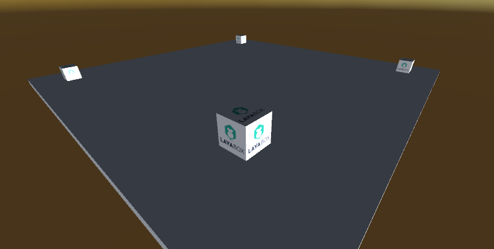
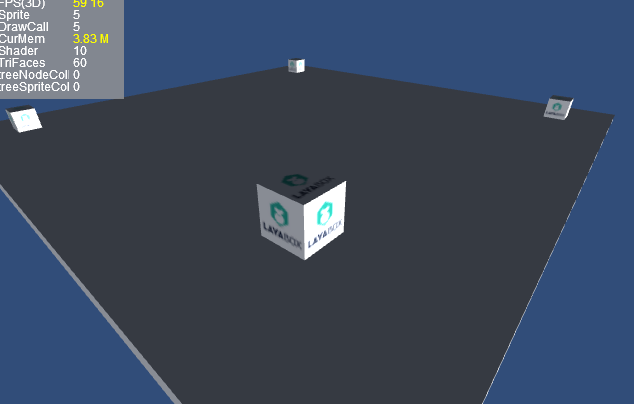

# 快速预览场景

快速预览能看到当前场景在LayaAir中的显示效果。也就是 **导出设置** 中的 **LayaAir Run** 按键。

**LayaAir Run使用须知:**

​	1.必须安装Node环境

​         2.场景中确保有一个照相机,自行调整其位置，角度，最终layaAir运行效果会与Unity运行结果保持一致。

在Unity中的显示效果（图1）：

<br>(图1)

在LayaAir 中预览的效果（图2）：

<br>(图2)

### 预设/场景的导出

打开我们刚才预览的场景，当配置好输出场景设置后，点击Laya Export 按钮，导出一个Scene与Sprite3D各一个，合并的一个文件夹目录结构如下（图3）。

<br>(图3)

见上图文件资源，导出后生成了.ls、.lm、.lmat数据资源，及贴图jpg、png资源。

它们的具体用法，将在后续课程文档中详细介绍。

**Tips:同时导出时是必须使用LayaAir3D的材质球，否则在导出后显示会有较大差距，而且部分是不能使用的。关于场景模型支持Unity导出的，能在 菜单栏--LayaAir3D--Help--Tutorial中查看。**

在菜单栏--LayaAir3D--Shortcuts--Switch to LayaAir3D shader，能将项目内所有材质改为LayaAir3D的默认材质（BlinnPhong）。

在导出完成后，我们把文件复制到简单示例的bin文件夹下。

Tips：本章节中只介绍简单加载应用，导出后会生成各种格式，它们的详细说明我们将在3D技术文档中“资源加载篇“介绍。

加载场景.ls示例代码如下(这里我们直接修改GameUI类)。

```typescript
package script {
    import ui.test.TestSceneUI;
	import laya.d3.core.scene.Scene3D;
	import laya.d3.core.Camera;
	import laya.display.Stage;
	
	/**
	 * 本示例采用非脚本的方式实现，而使用继承页面基类，实现页面逻辑。在IDE里面设置场景的Runtime属性即可和场景进行关联
	 * 相比脚本方式，继承式页面类，可以直接使用页面定义的属性（通过IDE内var属性定义），比如this.tipLbll，this.scoreLbl，具有代码提示效果
	 * 建议：如果是页面级的逻辑，需要频繁访问页面内多个元素，使用继承式写法，如果是独立小模块，功能单一，建议用脚本方
	 */
	public class GameUI extends TestSceneUI {
		public function GameUI():void {
			super();
			//加载场景
	Scene3D.load('LayaScene_test/Conventional/test.ls',Handler.create(this,onComplete))
		}
		/**
		 * 加载完成
		 */
		private function onComplete(scene:Scene3D):void{
			// 将场景加到舞台上
			Laya.stage.addChild(scene);
		}
	}
}
```

运行效果（图4）：

<br>(图4)