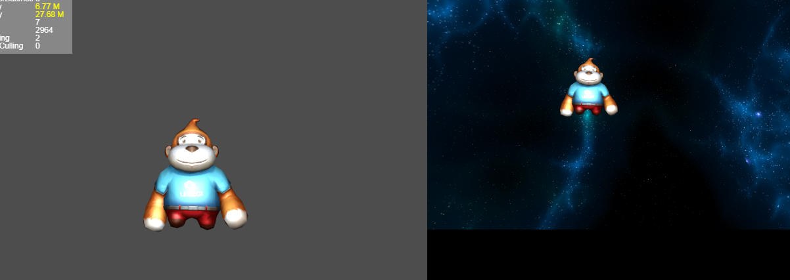

# 多摄像机窗口的使用

###### *version :2.0.1beta   Update:2019-3-19*

​	在同一个场景中，可以使用多个摄像机，当加载到场景中后，它们会产生各自的游戏视图画面。在我们以前遇到的游戏中，如双人3D游戏就使用了两个3D摄像机，左半屏幕显示一个玩家，右半屏幕显示另一个，极大的丰富了游戏性。

不过多摄像机的缺点是非常耗性能，模型三角面数与DrawCall数量会成倍上升，多几个摄像机就会多出几倍性能损耗，因此开发者们需酌情考虑。

3D场景的显示大小与位置与2D游戏不太一样，主要是靠摄像机的视口（ViewPort）来控制，通过它来进行屏幕的分割。

下例中我们创建一个场景，并且简单的加载一个模型，并通过ViewPort进行左右视口分离，代码如下：

```typescript
//创建场景
var scene = Laya.stage.addChild(new Laya.Scene3D());
//创建相机1
var camera1 = scene.addChild(new Laya.Camera(0, 0.1, 100));
//设置相机1清除颜色
camera1.clearColor = new Laya.Vector4(0.3, 0.3, 0.3, 1.0);
camera1.transform.translate(new Laya.Vector3(0, 0, 1.5));
//设置裁剪空间的视口
camera1.normalizedViewport = new Laya.Viewport(0, 0, 0.5, 1.0);

//创建相机2
var camera2 = scene.addChild(new Laya.Camera(0, 0.1, 100));
camera2.clearColor = new Laya.Vector4(0.0, 0.0, 1.0, 1.0);
camera2.transform.translate(new Laya.Vector3(0, 0.15, 0.5));
camera2.normalizedViewport = new Laya.Viewport(0.5, 0.0, 0.5, 0.5);

//添加平行光
var directionLight = scene.addChild(new Laya.DirectionLight());

//加载模型
Laya.Sprite3D.load("res/threeDimen/skinModel/LayaMonkey/LayaMonkey.lh", Laya.Handler.create(null, function(sp){
    //将模型加到场景上
    var layaMonkey = scene.addChild(sp);
}))
```

编译运行上述代码，运行效果如图6。开发者们同时也可以测试，在单摄像机下时，DrawCall与三角面数会少很多。（[demo地址](https://github.com/layabox/layaair-demo/blob/master/h5/3d/newDemo/newjs/cameraModule/MultiCamera.js)）

<br>(图1)
