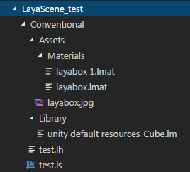
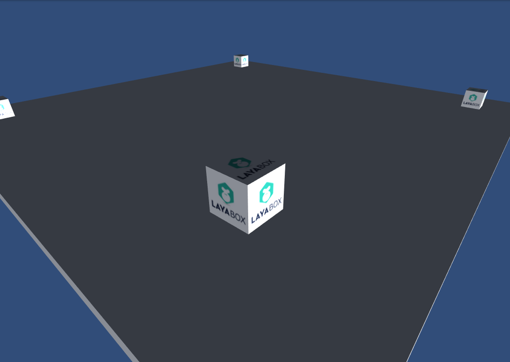

# 预设/场景的导出

打开我们刚才预览的场景，当配置好输出场景设置后，点击Laya Export 按钮，导出一个Scene与Sprite3D各一个，合并的一个文件夹目录结构如下（图1）。

<br>(图1)

见上图文件资源，导出后生成了.ls、.lm、.lmat数据资源，及贴图jpg、png资源。

它们的具体用法，将在后续课程文档中详细介绍。

**Tips:同时导出时是必须使用LayaAir3D的材质球，否则在导出后显示会有较大差距，而且部分是不能使用的。关于场景模型支持Unity导出的，能在 菜单栏--LayaAir3D--Help--Tutorial中查看。**

在菜单栏--LayaAir3D--Shortcuts--Switch to LayaAir3D shader，能将项目内所有材质改为LayaAir3D的默认材质（BlinnPhong）。

在导出完成后，我们把文件复制到简单示例的bin文件夹下。

Tips：本章节中只介绍简单加载应用，导出后会生成各种格式，它们的详细说明我们将在3D技术文档中“资源加载篇“介绍。

加载场景.ls示例代码如下(这里我们直接修改GameUI类)。

```javascript
export default class GameUI extends Laya.Scene {
    constructor(){
        super();
        //加载场景文件
        this.loadScene("test/TestScene.scene");
        //加载场景
        		Laya.Scene3D.load('LayaScene_test/Conventional/test.ls',Laya.Handler.create(this,this.onComplete))
    }
    /**
	 * 加载完成
	 */
    onComplete(scene){
        // 将场景加到舞台上
        Laya.stage.addChild(scene);
    }
}
```

运行效果（图2）：

<br>(图2)