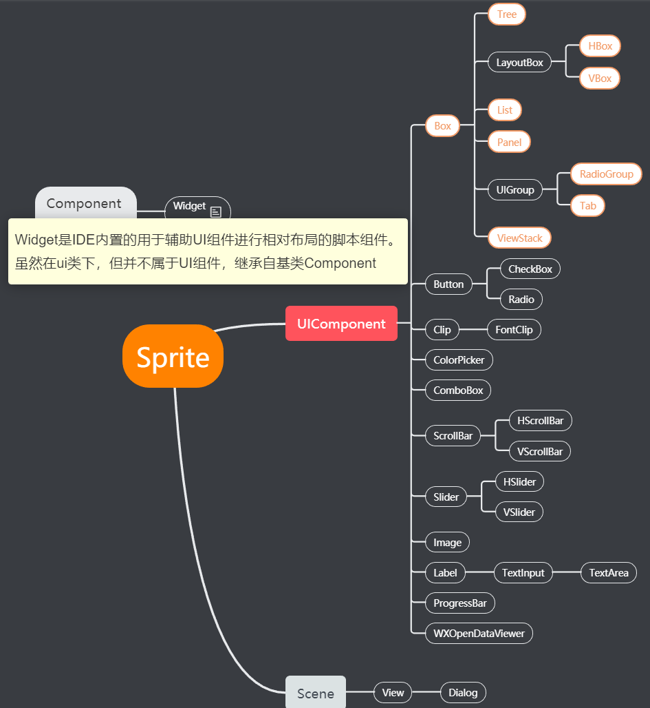

# UI组件的分类与继承关系

> author: charley	  version: 2.0.1	update:2019-04-02

组件是LayaAir引擎的游戏设计基础，几乎无处不在。LayaAir IDE中自带有2D基础组件（2D）、滤镜组件（Filters），绘图组件（Graphics）、物理组件（physics）、UI组件（UI）、公共组件（common），如图1所示。开发者也可以自定义组件。

 

（图1）

## 1、组件的分类

根据组件自身的结构和功能，可以将组件分成三大类。 分别是视图组件、容器组件、基础显示组件。

### 1.1 基础显示组件

基础显示组件是页面编辑里最常用的UI显示组件。通过资源管理器（Assets） 或 基础组件库（Basics） 里拖拽至场景编辑器中进行可视化操作。可以在`属性设置器`里设置其属性值，然后在场景编辑器中直接查看显示效果。

基础显示组件包括：Sprite、Button、CheckBox、Clip、ColorPicker、ComboBox、FontClip、HScrollBar、HSlider、Image、Label、TextArea、TextInput、Radio、ProgressBar、Slider、VSlider、ScrollBar、VScrollBar、WXOpenDataViewer。

> *Tips：*Sprite比较特别，即是基本的显示图形的显示列表节点，同时也是容器。在2.0里为了避免滥用UI组件，未按组件规则命名的组件不再识别为Image组件，默认识别为Sprite，这是性能最优的一种使用方式。

### 1.2 容器类组件

Sprite、Box以及继承自Box的UI组件属于容器类组件，这些容器类组件通常不需要以资源命名来识别组件，而是由一个或多个基础组件通过转化为容器的方式生成而来。在IDE里可以通过`Ctrl+B`快捷键将一个或多个基础组件转化为容器组件。如动图2所示。

 

 (动图2)

容器类组件包括：Sprite、Box、List、Tab、RadioGroup、ViewStack、Panel、HBox、VBox、Tree。

### 1.3 视图类组件

视图类组件是页面级显示对象容器。在 LayaAir IDE 的UI系统里，页面是用来承载显示所有的显示组件的，LayaAir的视图类组件分别为Scene、View、Dialog，在创建场景时使用，如图3所示。

 

 当不需要使用相对布局时默认使用Scene，当需要进行相对布局时，可以使用View。Dialog是用于制作弹窗页面时使用。

## 2、组件的继承关系

Sprite 类是 LayaAir 引擎中最基础的显示对象容器类，所有的UI组件都继承自基类Sprite，其中基础显示组件和容器组件都继承于Sprite的子类UIComponent。Sprite的子类scene是视图类组件的基类，view继承于scene，Dialog继承于view。具体的组件继承关系如图4所示。

## 3、组件属性详解入口

具体要了解各个组件的命名规则与组件的使用，请直接查看2.0的文档《IDE组件属性详解》

TS版链接地址： [https://ldc2.layabox.com/doc/?nav=zh-ts-2-3-0](https://ldc2.layabox.com/doc/?nav=zh-ts-2-3-0)

AS版链接地地：[https://ldc2.layabox.com/doc/?nav=zh-as-2-3-1](https://ldc2.layabox.com/doc/?nav=zh-as-2-3-1)

JS版链接地地：https://ldc2.layabox.com/doc/?nav=zh-js-2-3-1

## 本文赞赏

如果您觉得本文对您有帮助，欢迎扫码赞赏作者，您的激励是我们写出更多优质文档的动力。

 