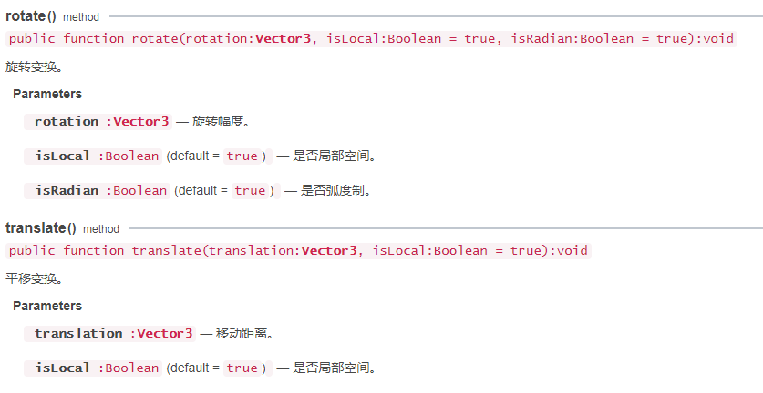
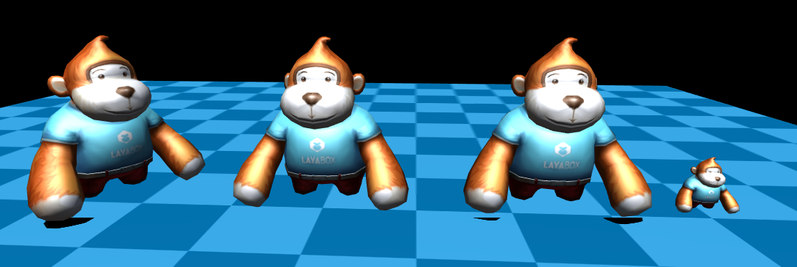

# LayaAir3D中的Transform变换

​	在前面讲过了LayaAir3D中的坐标系和几个基础数学工具，在示例代码中，transform是一个变换对象（[Transform3D](https://layaair.ldc.layabox.com/api2/Chinese/index.html?category=Core&class=laya.d3.core.Transform3D)API），他在3D的世界中非常的重要，所有有关显示对象变化的都会用到他。

​	在示例代码中已经用到了移动(translate)，旋转(rotate)这两种变换,并且用三维向量代表x，y，z的值。两种方法都可以在参数中设置是否为局部空间移动，旋转。

```typescript
	//移动摄像机
	camera.transform.translate(new Laya.Vector3(0, 3, 3));
	//旋转摄像机
	camera.transform.rotate(new Laya.Vector3(-30, 0, 0), true, false);
```

关于旋转，在Transform3D中提供了两种旋转接口，一种是角度/弧度旋转`rotate`，还一种是欧拉角旋转`localRotationEuler:Vector3`。

<br>(图1)

​	为了方便观察效果节选了官方示例（[demo地址](https://layaair.ldc.layabox.com/demo2/?language=ch&category=3d&group=Sprite3D&name=TransformDemo)）代码，首先我们 **克隆** 两个猴子（克隆的知识点会在精灵Sprite3D的章节详细讲解），来看下效果，并且在克隆后为了方便观察我们2个猴子的位置。

```typescript
//克隆sprite3d
var layaMonkey_clone1:Laya.Sprite3D = Laya.Sprite3D.instantiate(staticLayaMonkey, _scene, false, new Laya.Vector3(0.0, 0, 0.5));
var layaMonkey_clone2:Laya.Sprite3D = Laya.Sprite3D.instantiate(staticLayaMonkey, _scene, false, new Laya.Vector3(0.0, 0, 0.5));
var layaMonkey_clone3:Laya.Sprite3D = Laya.Sprite3D.instantiate(staticLayaMonkey, _scene, false, new Laya.Vector3(0.0, 0, 0.5));
//平移
layaMonkey_clone1.transform.translate(new Laya.Vector3(1.5, 0, 0.0));
layaMonkey_clone2.transform.translate(new Laya.Vector3( -1.5, 0, 0.0));
layaMonkey_clone3.transform.translate(new Laya.Vector3( 2.5, 0, 0.0));
```

<br>(图2)

​	然后测试我们的旋转和 **缩放** 变换。我们对克隆体1 按Y轴旋转90度，克隆体设置他的缩放值为（0.5，0.5，0.5）。再看下效果。（本次缩放使用的是局部缩放，世界缩放与局部缩放的原点相同，缩放参考的坐标系不同，且世界缩放的倍数是基于全局）。

```typescript
//旋转
layaMonkey_clone2.transform.rotate(new Laya.Vector3(0, 60, 0), false, false);
//缩放
var scale:Laya.Vector3 = new Laya.Vector3(0.1, 0.1, 0.1);
layaMonkey_clone3.transform.localScale = scale;
```

<br>(图3)

除了上面介绍的3中变换，transform中还有一些其他常用的属性和方法：

> 方法

`lookAt(target:Vector3, up:Vector3, isLocal:Boolean = false):void` 观察目标位置。

> 属性

`localPosition:Vector3` 局部位置。

`localScale:Vector3` 缩放。

`localMatrix:Matrix4x4` 局部矩阵。

`position:Vector3` 世界位置。

`localRotation:Quaternion` 局部旋转。

`scale:Vector3` 世界缩放。

`worldMatrix:Matrix4x4` 世界矩阵

`rotation:Quaternion` 世界旋转。

`right:Vector3`  [read-only] 获取向右方向。

`forward:Vector3`   [read-only]获取向前方向。


#### 3D世界中的子父关系

​	在3D世界中父节点变换，其子节点会跟着响应的变换。但是子节点发生变换并不会影响父物体。