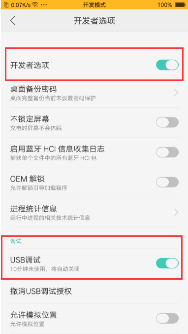
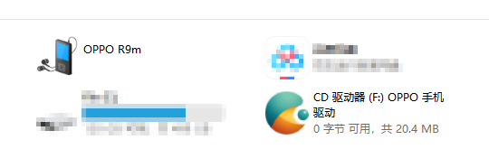
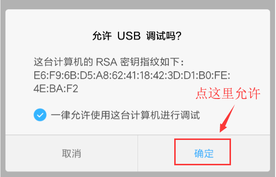
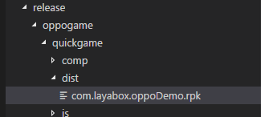

# OPPO小游戏发布与调试指南

> update : 2019-05-14
>

## 1、OPPO小游戏发布、调试环境准备

1、OPPO品牌的手机。

2、下载安装OPPO真机测试APP "快应用"（[OPPO 小游戏调试器](http://cdofs.oppomobile.com/cdo-activity/static/quickgame/tools/f04dec4cd2d9c8613483672ef4d8d045.zip) ）

点击括号中的链接可以直接下载 OPPO小游戏调试器"快应用"，或者前往OPPO官网文档（[https://cdofs.oppomobile.com/cdo-activity/static/201810/26/quickgame/documentation/games/use.html](https://cdofs.oppomobile.com/cdo-activity/static/201810/26/quickgame/documentation/games/use.html)）进行下载。

3、PC电脑的chrome浏览器与手机数据连接线。

4、安装nodejs 环境，建议安装 8.x 稳定版本 [node官网：[https://nodejs.org/en/](https://nodejs.org/en/)]

就是下载安装，比较简单，也不细介绍。能在命令行里调起npm命令就算是成功了。

5、LayaAirIDE集中开发环境，LayaAir 2.1.0 beta 或以上版本 [ 官网下载: [https://ldc2.layabox.com/layadownload/?type=layaairide](https://ldc2.layabox.com/layadownload/?type=layaairide) ]

6、安装ADB Shell

OPPO发布需要通过ADB Shell把rpk包推到games目录上去，所以这个必须要装。

 [ ADB官网下载:  [http://adbshell.com/downloads](http://adbshell.com/downloads) ]

> 提示一下，下载 ADB Kits，下载后的压缩包，建议解压放到一个路径简单一些的目录（如: `D:\adb`）。要记得添加环境变量（不知如何添加环境变量的可自行百度）。
>

## 2、OPPO小游戏发布与接入完整流程	      

### 1、发布前的准备工作检查。

为了让发布OPPO顺利一些，有一些检查工作我们要做。

第一、PC里，node环境、ADB Shell、Chrome这些，都必须要安装好。

第二、在OPPO的手机里，进入` 设置-> 其它设置-> 开发者选项` ，开发者选项与USB调试必须开启，如图1所示。

 

(图1)

另外要确保安装好OPOP小游戏调试环境“快应用”，如图2所示。

 

(图2)

第三、将PC电脑与手机用USB数据线相连，电脑里，可以出现类似图3一样的界面。比如，点击图3左上角的OPPO R9m，就可以进入手机存储。

 

(图3)

手机里要注意的是，屏幕保持点亮打开，在PC的IDE发布OPPO小游戏时，如果手机出现授权信息请求的时候，一定要点确定允许。如图4所示。

 

（图4）

### 2、发布OPPO小游戏包(xx.rpk)

LayaAirIDE的发布功能，内置了OPPO小游戏的发布功能，需要先将LayaAir引擎的项目，通过发布功能打成.rpk后缀的包。关于发布功能的使用。这里不重复介绍了。不会的可以前往官网文档查看。

链接：[https://ldc2.layabox.com/doc/?nav=zh-ts-2-0-6](https://ldc2.layabox.com/doc/?nav=zh-ts-2-0-6)

### 3、真机调试与Chrome输出

OPPO的调试必须基于真机调试，PC的chrome只能输出信息，看不到画面。

如果准备工作没问题的话，正常情况下，LayaAirIDE里成功发布OPPO小游戏之后，是rpk的包会自动出现在快游戏的OPPO小游戏列表中的（IDE通过调用ADB Shell推到指定的目录中），如图5所示。

 

（图5）

图5中的`OPPO测试`就是我们在发布的时候填写的游戏名称。如果我们看到自己对应的游戏名称，说明是正常发布成功了。点击秒开，就可以打开我们发布的游戏。

如果想看调试信息。这时就需要打开chrome浏览器。然后在输入栏里输入：

```
chrome-devtools://devtools/bundled/inspector.html?v8only=true&ws=10.10.82.111:12345/00010002-0003-4004-8005-000600070008
```

上面示例的IP地址`10.10.82.111`替换成自己手机上的IP就行。IP地址不知道怎么查的，自行百度。这里重点提示的是，PC电脑必须要和手机处于同一个网段的局域网环境下。

如果没问题，效果如图6所示。

 

（图6）

发布与调试，顺利的话至此就完成了。

### 5、发布未成功的处理经验。

发布文档中只讲功能使用，上面的文档是顺利情况下的流程。然而开发者可能不会那么顺利，那这里我们讲一讲经验。

#### 调试列表中未见游戏，是什么情况

如果我们发布的时候没能将rpk自动发到快游戏目录内，那图5的列表中，就没办法直接看到刚发布的小游戏。这时，需要检查adb shell是不是安装好了，图1的授权是不是开启了，大多数是adb shell或者授权有关。我们可以在PC的命令行下，输入adb shell，如图7-1所示。则是未获得USB调试模式授权。

  

（图7-1）

这时，我们要检查相关的设置。设置好之后，再次输入adb shell，应该如图7-2所示。这时候说明adb shell与授权没问题了。

  

（图7-2）

这些搞定后，我们再重新发布，应该就没问题了。

如果还有问题，一方面把问题反馈给Layabox官方团队，Layabox会与OPPO团队共同处理。另一方面，我们可以采用手工模式，把rpk包，复制到手机存储的games目录下，如果没有games目录则自己手工创建一下。

rpk包位于项目的release/oppogame/quickgame/dist 目录下，如图8所示。

  

（图8）

将发布生成的rpk文件，复制到手机存储的games目录下，如图9所示。

  

（图9）

这种方式，可以肯定能被OPPO小游戏的调试环境识别的。


## 本文赞赏

如果您觉得本文对您有帮助，欢迎扫码赞赏作者，您的激励是我们写出更多优质文档的动力。


