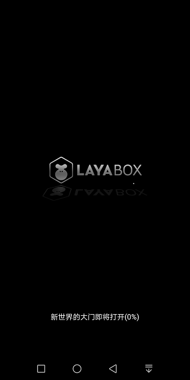

# LayaNative2.0

For developers, the biggest improvement of LayaNative 2.0 is to fully support LayaAir3D and facilitate the release of 3D-App versions for developers. In addition, LayaNative 2.0 overturns the five-generation LayaBox Native solution, aiming to be faster, more open, simpler and better 3D-enabled. Laya Native 2.0 adopts the concept of WebGL + patent technology design, which is more advanced and open. Like WebGL protocol, it is a compact and scalable solution with indefinite function rules. The following is a brief introduction from four aspects: engine structure, performance, function and ease of use.

## I. engine architecture
The project developed by the developer with LayaAir engine can be published into either browser or native App. The following is the structure diagram of the engine and the flow chart of the developer's development.

## II. engine architecture

After code refactoring, LayaNative 2.0's performance is greatly improved compared with version 1.0.
1、Compare Benchmark performance to LayaNative1.0

|       |2D   |3D     |
|:-----:|:----:|:-----:|
|Android|faster 10%|faster 90% |
|IOS    |faster 13%|faster 270%|

2、Compare Benchmark performance to others runtime in China (average estimation)

|       |2D    |3D       |
|:-----:|:-----:|:--------:|
|Android|faster 85%|faster 90%  |
|IOS    |faster 240%|faster 270%|

## III. Extended functions

1、LayaNative 2.0 supports single-threaded and double-threaded modes, and developers decide which mode to use according to the actual test results of their projects.

* Single thread mode: JS and Render run in one thread.
    * Advantages: No delay in operation (e.g. touch, key).
    * Disadvantage: Performance is not as good as dual-threaded mode.
* Two-threaded mode: JS and Render run in their respective threads.
    * Advantages: Performance is higher than single-threaded versions.
    * Disadvantage: The operation will have half a frame, the maximum delay to one frame (e.g. touch, key).

2、Supporting graphics card texture compression not only improves rendering efficiency, but also reduces memory usage.

3、Optimized secondary development makes it easier to understand and easy for developers to use. See the documentation for details:
https://github.com/layabox/layaair-doc/tree/master/LayaAir2.0/Chinese/LayaNative/Secondary_Development  

## IV. Ease of use

### 1. Provide more convenient debugging functions

1) Android platform can debug JavaScript

In the LayaNative 1.0 version, the JavaScript code in the debug project can only call the console.log or alert functions. The use of the Chrome browser to debug JavaScript code is officially supported in the layaNative 2.0 release. You can add breakpoints to the code in Chrome's debugger, code tracking and more.

See the documentation for details:
https://github.com/layabox/layaair-doc/tree/master/LayaAir2.0/Chinese/LayaNative/real_device_debugging  

2) Test App supports scan code startup project

In order to enable developers to debug development faster, the new version of the test app adds the ability to scan the code to launch the app, eliminating the need to manually enter the URL when debugging.

See the documentation for details:
https://github.com/layabox/layaair-doc/tree/master/LayaAir2.0/Chinese/LayaNative/How_To_Use_Runtime  

### 2. Can customize a more rich startup interface

LayaNative 2.0's loading view is developed in platform native language, Android uses Java language, IOS uses Objective-C language. Compared with Loading View developed in JavaScript language in 1.0, 2.0 provides a richer customization capability. Not only can you change pictures, but developers can also use platform language to achieve the functions they want.

For details see:
https://github.com/layabox/layaair-doc/tree/master/LayaAir2.0/Chinese/LayaNative/loading_view_new