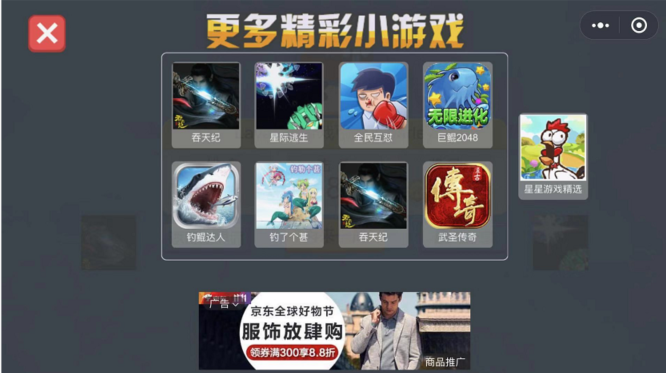
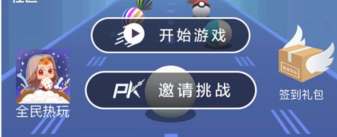

# 流量共享平台上架接入指南

**在对接中过程中如有问题请联系客服** `QQ:3150564572`

### 1、在小游戏的微信公众平台内添加安全域名

在微信公众平台登录要提交的小游戏帐号，登录之后，在`设置`栏目的`开发设置`页面内，找到`服务器域名`的配置项，点击修改，扫码进行身份认证后，在`配置服务器信息`页面里点击`加号`增加安全域名`https://unioncdn.layabox.com`到request合法域名和downloadFile合法域名里。增加后效果如下图所示：

 


### 2、在游戏中接入流量共享组件

小游戏的开发者需要在游戏中接入Layabox提供的流量共享组件，该组件从LayaAir IDE的1.7.22版本和2.0.0 beta4开始支持，如果开发者的IDE没有内置流量共享组件，请先下载或更新安装最新版本的LayaAirIDE。

在内置流量共享组件的版本里，开发者在设计模式下找到组件，直接拖拽到小游戏场景页面中即可完成接入，不需要编写接入代码。

#### LayaAir IDE 1.7.22beta 版本，具体操作步骤为：

1、找到流量共享组件：设计模式  >> 组件 >>  Common  >>  AdvImage ，

2、拖拽AdvImage到游戏UI页面中。

如下图所示：

 

#### LayaAir IDE 2.0.0 beta4 版本，具体操作步骤为：

1、找到流量共享组件：设计模式  >> Basics >>  Common  >>  AdvImage ，

2、拖拽AdvImage到游戏UI页面中。

如下图所示：

 

#### 非LayaAir IDE的接入指南：

如果是egret、cocos2d-js等第三方引擎的开发者，或者是使用了LayaAir引擎，没有使用LayaAir IDE的开发者。可以参照下面的方式进行接入。

##### 1、下载流量共享组件的js文件

https://layabox.github.io/layaair-doc/starGame/Chinese/AdvOTImage.zip

##### 2、在小游戏项目中引入流量共享组件的js文件:

```javascript
require("./AdvOTImage.js");//下载的附件放到相应的位置
```

##### 3、流量共享组件使用

**初始化流量共享组件显示**：

```javascript
//初始化流量共享组件显示
AdvOTImage.start(function(isShowIcon){
	//这里控制组件挂接的精灵对象的显示控制，isShowIcon true 显示；false 隐藏
    if(isShowIcon)
    {
        //显示
    }else
    {
        //隐藏
    }
});
```

> **提示**：egret、cocos的开发者使用流量共享组件，需要在项目层创建一个显示对象，然后通过AdvOTImage.start方法返回的回调参数控制当前显示对象的显示或隐藏，有些设备是不支持跳转接口的，这时会返回false，开发者用于隐藏当前的显示对象；

**流量共享组件注册icon监听方法**：

```javascript
/* 流量共享组件注册icon监听方法,
** gameIcon 为一个远端的图片路径，需要把路径赋值给挂接的显示对象即可
*/
AdvOTImage.change(function(isShowIcon,gameIcon){
//这里控制组件挂接的精灵对象的显示控制，isShowIcon true 显示；false 隐藏
    if(isShowIcon)
    {
        //显示
    }else
    {
        //隐藏
    }
});
```

```javascript
//跳转方法调用
AdvOTImage.navigateToMiniProgram();
```

> **提示**：AdvOTImage.change方法是在开发者每次调用AdvOTImage.navigateToMiniProgram()方法时，会主动触发回调或在组件内部定时切换触发回调，用于切换显示对象的显示内容；

### 3、在小游戏项目中加入跳转白名单

从基础库 2.4.0 开始，需要设置跳转的AppID到白名单里，才可以跳转。设置方式为，在game.json里增加navigateToMiniProgramAppIdList配置项，最多可配置十个。如下面的示例中所示：

```json
{
  "deviceOrientation": "portrait",
  "networkTimeout": {
    "request": 5000,
    "connectSocket": 5000,
    "uploadFile": 5000,
    "downloadFile": 5000
  },
  "navigateToMiniProgramAppIdList": [
    "wx24c7a0688503db70"
  ]
}
```

星星游戏精选是流量共享池，开发者游戏的闲散流量先汇集中到这个共享池中，再由池子中的流量二次分配流入到各个平台中的游戏。所以要设置跳转的白名单为星星游戏精选（AppID: `wx24c7a0688503db70`）

开发者在接入过程中遇到技术问题，可以通过QQ联系技术支持 `QQ:3150564572`。


### 3、在平台的游戏列表栏目中提交小游戏

##### 新增游戏 >>

然后在Layabox流量共享平台的`游戏列表`栏目中填写新增游戏中必须填写的内容。

`Path`、`Extra_data`为非必填选项。

需要上传的图片资源请先点击`文件上传上规范`，下载规范要求。按规范制作再上传，否则会导致无法通过审核。

其它选项比较直观，就不一一解释了。

##### 平台审核  >>

**审核的关键点**

由于小游戏能上线的都是被微信已经审过的游戏，所以平台审核，**只会审核流量共享组件是否已接入成功。**

所以，小游戏提交后，要及时接入流量共享组件，并提交微信版本审核。Layabox运营同学，会检查流量共享接口存在后，及时将游戏增加入流量共享池（星星游戏精选）中，平台的AI会根据贡献值给予曝光位置的展现。如果贡献度低于100将会不给予显示，达到100以上时，会自动显示到平台中。

#### 共享组件的展示位置

共享组件的展示位置非常关键，为什么呢。因为你放在显眼的地方（最好加上文字说明），这样去点击的概率才会大。为平台带去的流量贡献才会多。那游戏得到的流量也会更多。因为是等量交换的机制。如果游戏为平台带去了1000，那平台最终也会还给游戏1000或者更多，如果你只能给平台带去几十，当平台游戏总量超过30个之后（暂定30），则不会显示出来。只要不超过100贡献，或者贡献为负数的，都不会显示出来，直到积累超过100后，平台中才会显示出来。所以，要尽可能多一些位置和显眼的位置增加共享组件的曝光率，这样平台就可以根据贡献值为游戏带去更多数量的用户或有效点击。

**下面推荐一些平台中的案例**：

**案例一** ：

除了在游戏大厅的入口处，某游戏还在游戏结束后，单独设置了一个页面用于各种换量。不仅达到了流量交换的目标，也留出了非常不错的广告展示位置，如下图所示：

 

**案例二**：

在大厅中默认的共享组件下，增加一些关键字引导，比如下图中的全民热玩。大家可以用类似：新游试玩、精品游戏、更多游戏、好玩游戏等关键字，增加玩家对图标的辨识度，点击的玩家越多。交换带来的新用户也会越多。

 


#### 关于iOS入口的屏蔽

由于iOS的政策问题，iOS的版本正关闭整改，在整改通过之前，开发者可以在游戏内屏蔽iOS玩家对共享组件的可见。