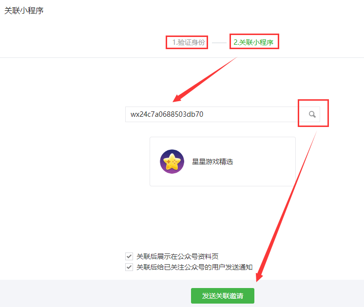

## 流量共享平台使用与上架接入指南

### 一、平台导航功能介绍

#### 1、平台介绍

平台介绍页面中会阐述平台建立的目标以及流量获得原理。

#### 2、使用指南

使用指南页面中会介绍平台的页面功能与**加入Layabox流量共享平台的详细技术指南**。

#### 3、运营数据

运营数据页面中会自动生成一个与后台自动绑定的小程序码，开发者可以扫一扫该小程序码，在微信端打开Layabox共享数据助手，在数据助手中查询自己的游戏在平台中的总流入、总流入，以及单个游戏的总流入贡献和总流出获得等关键数据。

#### 4、游戏列表

在游戏列表页面中，可以提交新的小游戏加入Layabox流量共享平台。也可以在游戏列表中查看和修改已提交的小游戏相关信息，还可以下架或上架等基础运营管理功能。


### 二、加入流量共享平台的完整上架流程

#### 1、AppID的关联

先在微信公众号（订阅号或服务号）中关联平台的AppID和要加入共享平台的小程序APPID。具体操作步骤如下：

##### 步骤一：关联流量共享平台的AppID

在微信公众平台登录订阅号或服务号（不是小程序号）。进入后点击左侧的`小程序管理`，然后点击右侧的`添加`按钮，在新弹出的添加小程序窗口里，点击`关联小程序`。如下图所示。

 

在弹出的二维码页面里，用管理员帐号扫码验证身份，然后会进入关联小程序的窗口。先输入平台的AppID：`wx24c7a0688503db70` 然后点击`放大镜`图标会显示出`星星游戏精选`的图标和字样。这时直接点击`发送关联邀请`即可。

 

**在接中过程中如有问题请联系客服** `QQ:3150564572`

> 注意：预计11月份微信平台接口将会改变为不再需要公众号绑定，在微信接口改变前，请务必要保障公众号中平台AppID与小游戏AppID关联着同一个公众号。

##### 步骤二：关联小游戏的AppID

除了关注平台的AppID，还需要关联要提交共享平台的微信小游戏AppID，只有两个小程序共同关联同一个公众号后，才可以互相跳转。具体操作方式和步骤一相同，AppID输入处替换为要提交的小游戏AppID即可。

#### 2、在小游戏的微信公众平台内添加安全域名

公众号中关联小程序AppID后，还需要登录要提交的小游戏帐号，登录之后，在`设置`栏目的`开发设置`页面内，找到`服务器域名`的配置项，点击修改，扫码进行身份认证后，在`配置服务器信息`页面里点击`加号`增加安全域名`https://unioncdn.layabox.com`到request合法域名和downloadFile合法域名里。增加后效果如下图所示：

 


#### 3、在游戏中接入流量共享组件

小游戏的开发者需要在游戏中接入Layabox提供的流量共享组件，该组件从LayaAir IDE的1.7.22版本和2.0.0 beta4开始支持，如果开发者的IDE没有内置流量共享组件，请先下载或更新安装最新版本的LayaAirIDE。

在内置流量共享组件的版本里，开发者在设计模式下找到组件，直接拖拽到小游戏场景页面中即可完成接入，不需要编写接入代码。

##### LayaAir IDE 1.7.22beta 版本，具体操作步骤为：

1、找到流量共享组件：设计模式  >> 组件 >>  Common  >>  AdvImage ，

2、拖拽AdvImage到游戏UI页面中。

如下图所示：

 

##### LayaAir IDE 2.0.0 beta4 版本，具体操作步骤为：

1、找到流量共享组件：设计模式  >> Basics >>  Common  >>  AdvImage ，

2、拖拽AdvImage到游戏UI页面中。

如下图所示：

 

#### 第三方引擎引入指南：

如果是egret、cocos2d-js等第三方引擎的开发者，可以参照下面的方式进行接入。

##### 1、下载流量共享组件的js文件

https://layabox.github.io/layaair-doc/starGame/Chinese/AdvOTImage.zip

##### 2、在小游戏项目中引入流量共享组件的js文件:

```javascript
require("./AdvOTImage.js");//下载的附件放到相应的位置
```

##### 3、流量共享组件使用

**初始化流量共享组件显示**：

```javascript
//初始化流量共享组件显示
AdvOTImage.start(function(isShowIcon){
	//这里控制组件挂接的精灵对象的显示控制，isShowIcon true 显示；false 隐藏
    if(isShowIcon)
    {
        //显示
    }else
    {
        //隐藏
    }
});
```

> **提示**：egret、cocos的开发者使用流量共享组件，需要在项目层创建一个显示对象，然后通过AdvOTImage.start方法返回的回调参数控制当前显示对象的显示或隐藏，有些设备是不支持跳转接口的，这时会返回false，开发者用于隐藏当前的显示对象；

**流量共享组件注册icon监听方法**：

```javascript
/* 流量共享组件注册icon监听方法,
** gameIcon 为一个远端的图片路径，需要把路径赋值给挂接的显示对象即可
*/
AdvOTImage.change(function(isShowIcon,gameIcon){
//这里控制组件挂接的精灵对象的显示控制，isShowIcon true 显示；false 隐藏
    if(isShowIcon)
    {
        //显示
    }else
    {
        //隐藏
    }
});
```

```javascript
//跳转方法调用
AdvOTImage.navigateToMiniProgram();
```

> **提示**：AdvOTImage.change方法是在开发者每次调用AdvOTImage.navigateToMiniProgram()方法时，会主动触发回调或在组件内部定时切换触发回调，用于切换显示对象的显示内容；

开发者在接入过程中遇到技术问题，可以通过QQ联系技术支持 `QQ:3150564572`。

#### 4、在平台的游戏列表栏目中提交小游戏

##### 新增游戏 >>

然后在Layabox流量共享平台的`游戏列表`栏目中填写新增游戏中必须填写的内容。

`Path`、`Extra_data`为非必填选项。

需要上传的图片资源请先点击`文件上传上规范`，下载规范要求。按规范制作再上传，否则会导致无法通过审核。

`公众号名称`要填写绑定小程序和小游戏AppID的订阅号或服务号名称，这是方便审核人员对应是帐号关联方是谁的辨识之用。

其它选项比较直观，就不一一解释了。

##### 平台审核  >>

**审核的关键点**

由于小游戏能上线的都是被微信已经审过的游戏，所以平台审核，**只会审核流量共享组件是否已接入成功。**

所以，小游戏提交后，要及时接入流量共享组件，并提交微信版本审核。Layabox运营同学，会检查流量共享接口存在后，及时将游戏增加入流量共享池（星星游戏精选）中，平台的AI会根据贡献值给予曝光位置的展现。

#### 共享组件的展示位置

共享组件的展示位置非常关键，为什么呢。因为你放在显眼的地方（最好加上文字说明），这样去点击的概率才会大。为平台带去的流量贡献才会多。那游戏得到的流量也会更多。因为是等量交换的机制。如果游戏为平台带去了1000，那平台最终也会还给游戏1000或者更多，如果你只能给平台带去几十，当平台游戏总量超过30个之后（暂定30），则不会显示出来。只要不超过100贡献，或者贡献为负数的，都不会显示出来，直到积累超过100后，平台中才会显示出来。所以，要尽可能多一些位置和显眼的位置增加共享组件的曝光率，这样平台就可以根据贡献值为游戏带去更多数量的用户或有效点击。